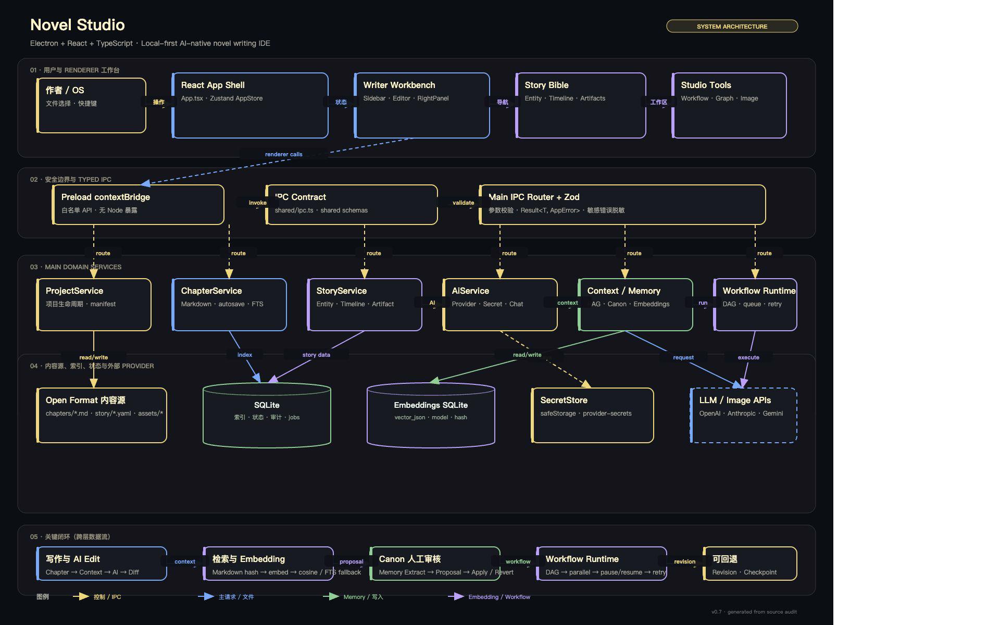

<div align="center">


# Novel Studio

## 让长篇小说创作，拥有一套真正可靠的工作系统

Novel Studio 是一款 AI 原生、桌面优先、面向长篇创作的小说写作 IDE。
它把正文编辑、故事圣经、上下文管理、AI 协作、可追踪工作流和视觉资产，放进一个连贯的创作空间。

**写得更快，也记得更准；让每一次 AI 协作都可理解、可审阅、可掌控。**

[返回开发 README](README.md) · [查看系统架构](docs/ARCHITECTURE.md) · [开始体验](#三分钟开始体验)

</div>



> [!NOTE]
> Novel Studio 当前为 active development 项目。下面的介绍描述的是已经在代码和测试中验证的产品方向与能力，不是虚构的已发布 SaaS 功能清单。

## 为什么需要 Novel Studio

长篇小说最难的部分，往往不是写出下一段文字，而是让几十万字在几个月后仍然保持一致：人物不能突然改名，时间线不能互相打架，伏笔不能因为一次 AI 重写而消失，创作素材也不能被锁进一个不可迁移的黑盒。

Novel Studio 围绕这些真实问题设计：

| 创作痛点 | Novel Studio 的回应 |
| --- | --- |
| 灵感、设定和正文散落在多个工具 | 一个项目目录组织章节、世界观、工作流与资产 |
| AI 续写很快，但容易忘记前文 | Context Engine 与 Story Bible 为生成提供可检查的上下文 |
| AI 改稿无法判断哪里变了 | Diff / Suggestion 逐项审阅，支持接受、拒绝、取消、重试 |
| 长篇设定经常出现冲突 | Canon 检查发现事实冲突，并提供提案与回滚路径 |
| 复杂创作任务难以重复执行 | Workflow 以 DAG 组织步骤，支持并行、重试、超时和暂停 |
| 创作数据被平台锁定 | Markdown、YAML 与本地 SQLite 协同，优先保证可读与可迁移 |

## 一张图看懂创作闭环

```text
灵感与素材
    ↓
Story Bible ──→ Context Engine ──→ AI Writer / Critic
    ↑                                  ↓
时间线、角色、地点                    Diff 审阅
    ↑                                  ↓
正文 Markdown ←──── 接受 / 拒绝 / 回滚
    ↓
Workflow Runtime ──→ 插画资产 / 备份 / 可重复验证
```

## 核心体验

### 1. 像写作软件一样自然，像 IDE 一样有秩序

三栏式桌面工作台把章节导航、编辑区、故事上下文和 AI 对话放在同一个视野里。章节正文以 Markdown 为唯一可信来源，富文本编辑体验与可读文件格式同时保留。

### 2. 故事圣经不是笔记，而是可参与创作的数据层

角色、地点、组织、物品、别名、时间线和关系都可以结构化保存。AI 不再只能“猜”你的设定，而是可以基于项目上下文工作。

### 3. AI 输出先审阅，再进入正文

生成、续写、改写和批评结果以 Diff / Suggestion 形式呈现。你可以查看变化、接受部分结果、拒绝整段修改，或者在不满意时取消与重试。

### 4. 复杂任务可以变成可重复的工作流

从“读取章节 → 提取事实 → 检查冲突 → 生成修改建议 → 人工确认”，到更复杂的并行任务，都可以通过 Workflow 编辑器和持久化 Runtime 组织起来。

### 5. 视觉资产与文本世界观在同一项目中协作

场景资产保留来源信息和结构化描述，Illustration Studio 为未来的封面、场景图和视觉化创作提供扩展点。

## 功能全景

| 能力域 | 当前能力 |
| --- | --- |
| 项目管理 | 创建、打开、最近项目、崩溃恢复、项目根路径沙箱 |
| 章节写作 | Markdown 双向转换、自动保存、脏标记、实时字数、全文搜索、Command Palette |
| Story Bible | Character / Place / Organization / Item、别名、时间线、关系与 YAML 文件 |
| AI 协作 | Provider profile、密钥存储、SSE 流式响应、续写、改写、批评与重试 |
| 可控修改 | Diff preview、Suggestion、Accept / Reject / Cancel / Retry、revision 记录 |
| 一致性 | 三层 Context、Token budget、Context Inspector、Fact Proposal、Conflict、Apply / Revert |
| 自动化 | React Flow 编辑器、DAG 校验、并行、超时、重试、取消、Human pause / resume |
| 资产管理 | 场景资产、provenance、图片服务、备份与恢复、迁移 fixture |
| 工程质量 | typed IPC、统一错误模型、SQLite WAL、FTS5、确定性测试与安全边界 |

## 谁会喜欢它

- 正在写长篇小说、系列小说或世界观复杂作品的作者
- 希望使用 AI，但不想把最终控制权交给黑盒生成器的创作者
- 需要角色、时间线、设定和章节之间保持一致的编剧与内容团队
- 想把重复性的审稿、事实提取和改稿任务流程化的工作室
- 喜欢本地文件、可迁移数据和桌面效率工具的技术型写作者

## 三分钟开始体验

```bash
git clone https://github.com/wjyzhixing/novel-studio.git
cd novel-studio
pnpm install
pnpm dev
```

如果你使用 npm：

```bash
npm install
npm run dev
```

项目内置 demo 和 fixtures，便于快速查看章节、世界观与工作流样例。默认测试使用临时项目和确定性 Provider，不需要真实模型 API Key。

## 设计原则

**Local-first**：你的项目以本地目录为核心，正文 Markdown、设定 YAML、索引 SQLite，各自承担清晰职责。

**Human-in-the-loop**：AI 负责提出可能性，人负责决定什么成为正文与 Canon。

**可解释的变化**：所有重要修改都应该能被看见、理解、接受或撤销。

**安全边界优先**：Electron 开启 `contextIsolation`，关闭 `nodeIntegration`，通过 preload 暴露受控 API，并对项目路径、输入和权限进行校验。

**工程化但不打扰写作**：复杂性沉到数据与工作流层，编辑器仍然保持快速、连续和专注。

## 诚实的项目状态

Novel Studio 目前处在从“可运行原型”走向“可持续使用的桌面产品”的阶段：

- ✅ 主线能力已通过自动化测试与构建验证
- ✅ macOS / Windows 打包链路已有验证脚本
- 🚧 桌面交互、扩展系统和发布体验仍在快速迭代
- 🚧 正式签名、公证、自动更新和长期数据迁移策略尚未完成
- ⚠️ 当前版本不建议作为唯一生产数据存储，请保留独立备份

## 接下来会走向哪里

1. 继续打磨章节写作与 AI 对话的连续体验
2. 完善扩展系统、权限模型和 Provider 生态
3. 提升长篇项目的搜索、索引、迁移和备份可靠性
4. 完成桌面发布所需的签名、公证、安装与更新流程
5. 建立更完整的端到端创作路径与真实项目验证

## 参与项目

如果你对“AI 如何帮助作者长期维护一个世界”感兴趣，欢迎通过 Issue 分享：

- 你的写作工作流和痛点
- 对 Story Bible / Canon / Workflow 的使用想法
- 跨平台桌面体验反馈
- 可复现的 Bug、测试用例或文档改进

开发细节请从 [README.md](README.md) 开始；架构与边界说明见 [docs/ARCHITECTURE.md](docs/ARCHITECTURE.md)。

## 项目链接

- GitHub：[wjyzhixing/novel-studio](https://github.com/wjyzhixing/novel-studio)
- 开发入口：[README.md](README.md)
- 架构文档：[docs/ARCHITECTURE.md](docs/ARCHITECTURE.md)
- 示例项目：[demo/](demo/)
- 测试样本：[fixtures/](fixtures/)

<div align="center">

**Novel Studio — 给长篇创作一套可以长期信任的工具。**

</div>
