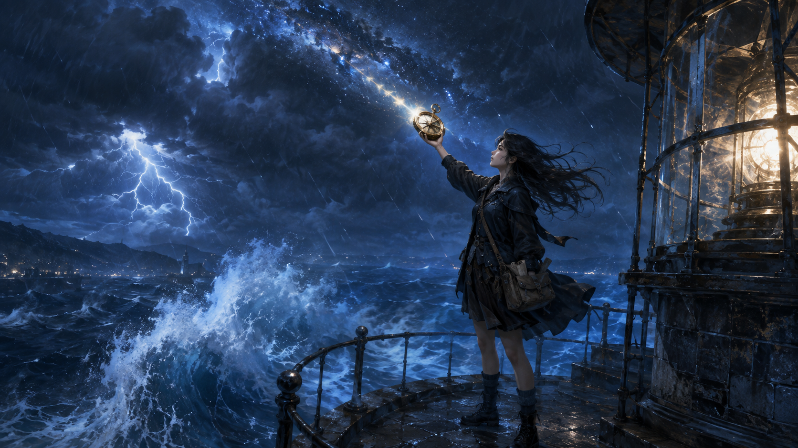
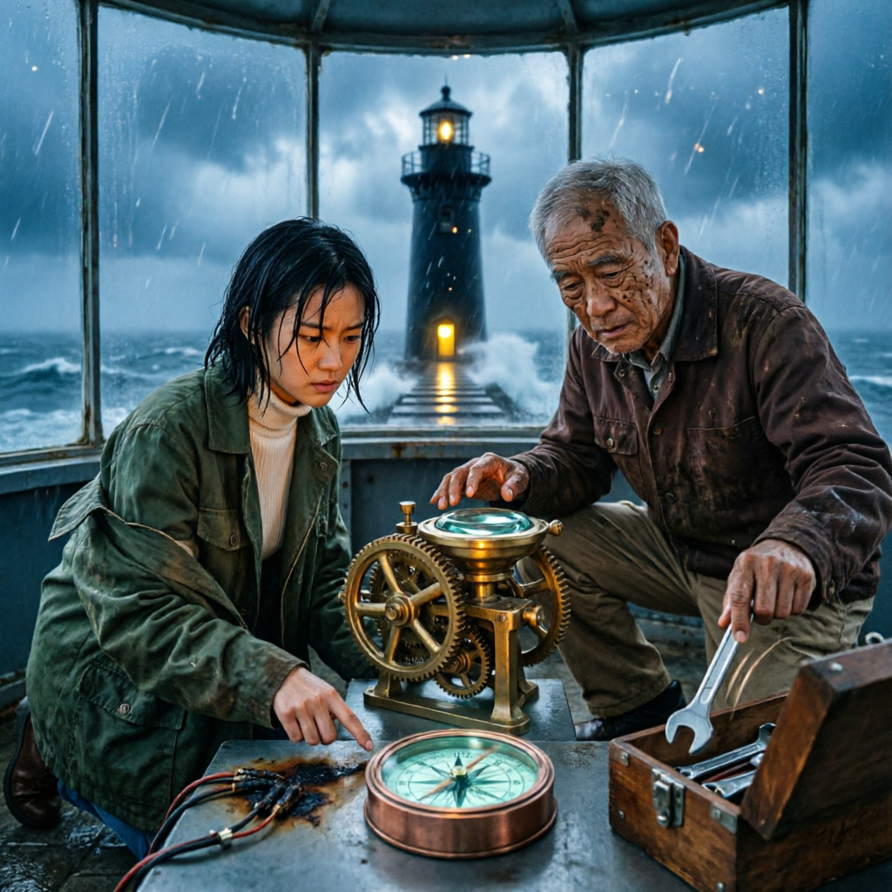

# 美国之风

风是从午夜之后开始变调的。

林月蜷在港务局值班室的窗台下，后背抵着冰凉的石墙。门板在外面的狂风中像一只不安分的拳头，一下、一下地擂着门框。屋顶某处铁皮被揭开的声响传来，她被那撕裂声扎了一下。怀中那个沉甸甸的潮汐罗盘顶住她的肋骨，铜壳冰凉，像揣了一小块深海。

她把它取出来，摊在掌心。

指针在剧烈地颤动。不是那种寻找磁北极时微微摆动，而是死命地转着圈，像一只被关进笼子里的萤火虫。林月的眉头拧起来——这罗盘她第一天收到时，指针稳稳地指向雾港正北。那是清晨六点，港口的晨雾还没有散。而现在是第三天的深夜，它疯了。

不是它疯了。林月纠正自己，是天气疯了。她师傅说的，当起风的时候，海先变脸。

风声骤然抬高了八度，她听到外面传来什么东西被卷起的闷响，然后是砸在石阶上的碎裂声。她猛地从窗台边探出头去，透过雨幕，看见潮汐灯塔顶端的灯——那盏永远在雾夜亮起的光——正一下一下地闪着，像瞎了的眼睛。

然后它彻底熄灭了。

“操。”

她重新裹紧了油布外套，拉开门，冲进那团湿黏的黑。风直接把她拍在门框上，但她咬着牙，把自己推出去。港口到灯塔的距离她在白天走过无数遍，四百步。可今晚的风像是一个有脾气的东西，从海面上爬过来，拖着海水和沙子，一下下地抽打她。

她几乎是半爬半走地抵达灯塔塔基门口。门虚掩着，缝隙里漏出一线暖色的油灯光。

门在她身后被风掼上了。陡峭的石阶向上盘旋，她踩着湿脚印往上爬，到控制室的时候喘得说不出话。

何执已经在那里了。老人背对着她，一只手握着扳手蹲在机械旁，另一只手正试图把透镜底座下的某个齿轮拨正。他没有回头，声音闷闷的传过来：“门没锁就是等你的。外头那风，疯了吧。”

“你早该告诉我灯塔的灯会灭。”林月把罗盘放在台面上，脱掉湿透的外套拧了一把，“白天的例行检查我没发现异常。”

“那不是异常。那是有谁不想让我们亮起来。”

何执终于回头看了她一眼。油灯的光在他沟壑纵横的脸上跳动，眼角那几道纹路像被风蚀过的礁石。他又转回去，手里的扳手被丢进工具箱，发出一声清凌凌的金属响：“备用系统失灵了。电池组泡了水，线路烧了。”

“烧了？”林月快步走过去，推开老人自己蹲下——她看图纸比看他快。“哪里烧的，我——”

“不用看了。”

何执的手背在身后，走到控制台边，把那碗还温热的茶端起来，不急不忙地吹了一口。

“我看了三十年的灯，这盏灯从来不会因为风雨而灭。它灭，是因为有人要它在今晚灭。”

林月直起腰，盯着他。

“你把话说清楚。”

“我说不清楚。但那玩意儿——”他朝桌面上的潮汐罗盘努了努嘴，“——能说清楚。”

“它一直在转圈。疯了。”

“它没疯。”何执把茶杯放下来，声音平静得像一潭死水，“它是在找。你过来。”

林月犹豫了一下，还是走过去。何执没看她，只是把罗盘从台面上捡起来，托在掌心里，然后缓缓地走向控制室深处。

那里有一面嵌在石壁里的铁板，锈迹斑斑，看上去像是建筑早期留下的排污口盖板。何执踮起脚，把罗盘往那铁板表面一贴——

指针猛地停住。

那是一种被完全驯服的停，像一枚被磁石捕获的针。它不再转圈，也不颤抖，而是稳稳地指向一个方向——斜向下方，穿透地板，穿透石阶，穿透灯塔的基础，指向雾港湿冷的深处。

林月的呼吸停了一拍。

“那下面有什么？”

何执把罗盘收回来，指针立刻恢复无头苍蝇般的乱转。他把罗盘递还给她，粗糙的掌心在她手背上一碰。他说：“你把那东西从我手里拿过去的时候，它指哪儿？”

林月低头看了一眼：“指向我。”

“它是认你的。”

风暴就在这时撞击了塔身。整座灯塔晃了一下，像一只被巨兽撞了一角的兽骨。头顶传来“哐”的一声巨响——是透镜支架塌了。何执的脸一瞬间变了颜色。

“我上去固灯。”

“备用灯还没——”

“不用备用灯。”何执已经推开控制室的门，风灌进来，他回头看她一眼，眼里有一种她看不懂的笃定，“你带着罗盘下来。那东西会告诉你，灯该往哪儿照。”

林月张了张嘴，想说“这是什么迷信的话”，但风已经把他的话撕碎在了楼梯间里。门掼上了，她被留在控制室里。罗盘在她的掌心依旧焦躁地转动着，像一只被关在掌心里的鸟。

她低头看着它。

然后她说，用只有自己能听见的声音：“你最好别骗我。”

---

她追上何执的时候，他已经半跪在塔顶灯室的门口。头顶的穹顶碎了一块，雨水顺着裂缝灌进来，在地板上汇成一面晃晃荡荡的镜子。何执正把那盏昏黄的油灯举向透镜支架的方向，光线在碎玻璃之间折射出千万道细碎的芒。

她的目光落在地上。

灯室中央的地板上，不知何时裂开了一道宽约两指的缝隙。从缝隙里透出来的不是水泥、不是泥土、不是水，而是一种泛着幽蓝光泽的烟霭状物质，像海底深处某种古老的萤光在缓慢地呼吸。

罗盘在她的手里安静下来了。

林月低头。指针稳稳地指向那条裂缝。

她跪下来，把罗盘放在裂缝边上，又把手探进那道缝——她的手指触到一块金属。凉的，边缘光滑，像一把被遗忘多年的钥匙。她轻轻一抠，那东西松动，滑出来，是一枚嵌着铜钉的旧铭牌，上面刻着几行字，字迹被锈蚀了大半，只依稀辨认出三个字：

“星之脐。”

“何叔。”她听到自己声音发紧，“你从没说过灯塔底下还有一层。”

何执沉默地看了她很久。屋外的风把整座灯塔抬起来又摔下去，塔身发出令人牙酸的吱嘎声。淋下来的雨水浇灭了油灯，他们被吞进一片绝对的黑暗。

但罗盘在发光。

是一种极微弱的、冷蓝色的磷光，从罗盘铜壳的缝隙间渗透出来，铺在地板上，照出一个浅浅的圆。光影落在何执的脸上，他眼中的神情终于变了——那不是恐慌，不是惊骇，而是一种经历了漫长等待之后才终于抵达的、近乎平静的承认。

“我没跟你说过。”他轻声说，“因为我没想到它认你。”

他伸出手来，握住她握着罗盘的那只手，把罗盘抬起来，对准地板裂缝的方向。光线在罗盘的边缘汇聚成一束，指向那道裂缝的深处——那个方向与雾港的任意一处地理坐标都无关，它指向海面以下，指向某片不该存在的空间。

“你第一天来的时候，你问这灯塔是防什么的。”

林月看着那束冷光，声音有些干涩：“我说，它是防雾的。”

“是防雾的。”何执的手在微微颤抖，但声音仍然稳，“但防的不是外面的雾。”

罗盘在她手中震动了一下。一种从未有过的、从齿轮深处传来的低鸣声，像某种沉睡多年的野兽被唤醒时的第一声哈欠。光柱在黑暗中突然生成的纤维交织成一张网，向地面之下蔓延，那些幽蓝色的丝线穿透地板、穿透岩石、穿透海水，最终指向——

林月看见那道光柱的末端，在海面上，浮现出一个轮廓。

那是一座岛。

不是雾港外任何一座在地图上标注过的岛。它轮廓模糊得像一幅褪色的水墨画，却在风暴最猛烈的那一刻清晰得几乎可以看见它岸上的树影。它悬在海面上方大约数尺的位置，像是空间在暴风中被撕开了一道口子，露出另一个世界的角落。

然后它消失了。

光柱熄灭，罗盘的指针重新开始打转，一切恢复如常。

林月站在塔顶，浑身湿透，手仍然保持着方才握罗盘的姿态，一动不动。

何执退后一步，扶着断裂的栏杆站起来，声音像从很远的地方传过来：“风停了。”

雨声不知从什么时候开始平息了下去。塔身的晃动也安顿下来，像一头巨兽在疲惫地喘息。雾港寂静得只剩下滴水声和远处海浪拍打礁石的闷响。

“那是什么？”她问。

“我跟你说过。”何执沉默了一会儿，才低声说，“这座灯塔，不是为了防风暴的。它是为了等某样东西的。”

罗盘在沉默中发出一声极轻的“咔哒”声。林月低头，看见它的指针，已经不再转圈了。

它稳稳地指着一个方向，穿过地板上那道裂缝，穿过雾港坚硬的岩层，指向地下深处那个她还没踏足的地方——有蓝色火光和星图的，地下星图库。

林月把罗盘收进怀中，握紧。她没有问何执更多。

她打算第二天晚上去看看。

