# Novel Studio 架构说明

> 面向架构师、开发者和第一次接触项目的读者。
>
> 本文描述当前代码实现（Novel Studio v0.7），不是未来规划。代码发生变化时，应同步更新本文和架构图。

## 1. 先用一句话理解项目

Novel Studio 是一个 **Electron 桌面端的 AI 原生小说写作 IDE**：

1. 用户在 React 编辑器里写章节；
2. 主进程通过安全的 typed IPC 读写项目文件和 SQLite；
3. Context Engine 从当前章节、Story Bible、Canon 和历史内容中拼出受 token 预算约束的上下文；
4. AI Provider 生成回答、修改建议、记忆提案或图片；
5. 用户通过 Diff、Canon Review、Revision、Checkpoint 决定哪些结果真正落盘。

最重要的设计原则是：

> Markdown/YAML/JSON 是作品数据的源文件；SQLite 主要负责索引、运行状态、审计和缓存。

因此，数据库损坏或索引过期时，系统可以从项目文件重建大部分派生数据，而不会把小说正文锁死在数据库里。

---

## 2. 阅读路线

如果你是第一次看项目，按这个顺序阅读：

| 顺序 | 看什么 | 要回答的问题 |
| --- | --- | --- |
| 1 | [总体分层](#3-总体分层) | 哪些代码运行在 Renderer，哪些运行在 Main？ |
| 2 | [一次请求](#5-一次用户操作如何穿过系统) | 点击按钮后，数据怎样经过 IPC？ |
| 3 | [项目文件与数据库](#6-项目数据布局源文件与派生数据) | 什么是事实来源，什么可以重建？ |
| 4 | [Context 与 Embedding](#8-context-engine如何组装给-ai-的上下文) | 为什么需要 Embeddings SQLite？ |
| 5 | [AI Edit 与 Canon](#9-ai-edit从生成到可回退修改) | AI 输出为什么不会直接覆盖正文？ |
| 6 | [Workflow Runtime](#10-workflow从可视化-dag-到可恢复执行) | 自动化流程如何暂停、重试和恢复？ |
| 7 | [安全与故障](#11-安全边界与故障处理) | 外部输入和失败如何被控制？ |

架构师可以直接从图和“边界/事实来源/失败策略”开始；小白建议先读本节和第 4、6、7 节。

---

## 3. 新人使用说明：从零开始写第一章

本节是给第一次打开 Novel Studio 的用户看的。你不需要先理解 SQLite、Embedding 或 Workflow；先按主线完成一次写作，再回头了解高级功能。

### 3.1 启动项目

在项目根目录执行：

```bash
pnpm install
pnpm dev
```

也可以使用 npm：

```bash
npm install
npm run dev
```

启动后会看到欢迎页，有三种常用入口：

| 入口 | 适用场景 | 操作 |
| --- | --- | --- |
| 创建新项目 | 开始一部新作品 | 输入作品名，选择一个空文件夹 |
| 打开已有项目 | 继续已有作品 | 选择包含 `novel.yaml` 的项目文件夹 |
| 项目恢复 | 从备份继续工作 | 选择 Novel Studio 导出的 ZIP 备份和恢复目录 |

项目创建完成后，应用会在目标目录生成 `novel.yaml`、`chapters/`、`story/`、`world/`、`workflows/`、`assets/` 和 `.novel/` 等目录。不要手动删除 `.novel/`，其中包含索引、Revision、Checkpoint 和运行记录。

### 3.2 第一次配置模型

如果只想浏览界面，可以跳过本节；如果要使用 AI、Embedding 或图片生成，需要先配置 Provider。

1. 点击顶部当前模型按钮（未配置时通常显示“未配置 Provider”）；
2. 点击“新建 profile”；
3. 在“连接”页填写名称、协议、Text Base URL 和 Text Model；
4. 在 Text API Key 中输入密钥；密钥不会写入项目文件，而是使用操作系统安全存储；
5. 点击“测试文本连接”；
6. 点击“保存”；
7. 如果存在多个 profile，在左侧 profile 列表中点击目标 profile 的“使用”。

可选配置：

- 填写 `Embedding Model`，再点击“测试 Embedding 连接”，启用语义检索；
- 填写 Image Base URL、Image Model 和 Image API Key，启用插图生成；
- 填写输入/输出 token 单价，让 Developer 面板估算费用；
- 测试通过后，关闭弹框即可回到写作界面。

常见 Provider 配置示例：

| 类型 | Text Base URL | 说明 |
| --- | --- | --- |
| OpenAI-compatible | `https://api.openai.com/v1` | 也可填兼容 OpenAI API 的服务地址 |
| Anthropic | 按 Provider 文档填写 HTTPS 地址 | 使用 Anthropic 协议适配器 |
| Gemini | 按 Provider 文档填写 HTTPS 地址 | 使用 Gemini 协议适配器 |
| Mock | 无需真实 key | 适合测试界面和自动化测试 |

如果不配置 Embedding Model，项目仍然可以使用 SQLite FTS 全文搜索；Embedding 不是启动项目的硬性依赖。

### 3.3 创建并编辑章节

左侧 `CHAPTERS` 区域是章节树：

1. 点击章节区域右上角的 `+`；
2. 输入章节标题并按 Enter；
3. 点击新章节打开编辑器；
4. 在中间编辑正文；
5. 编辑器会自动保存，底部状态栏会显示保存状态和字数。

章节正文以 Markdown 保存。推荐使用一级标题作为章节标题，例如：

```markdown
# 第一章 雨夜入城

城门关闭前，沈砚终于赶到了长安。
```

左侧章节支持：

- 拖拽调整章节顺序；
- 创建卷并把章节归入卷；
- 通过章节右侧菜单删除章节；
- 删除章节后，Revision、Canon 和 Workflow 历史仍会保留，但正文文件会被删除。

### 3.4 使用右侧 Agent

打开章节后，右侧面板默认有 `Agent`、`Workflow`、`Outline` 三个 tab。最常用的是 Agent：

1. 在输入框提问，例如“总结这一章的冲突”；
2. 按 Enter 或点击发送按钮；
3. 等待回答完成；
4. 需要停止时，点击同一个位置的取消按钮。

右侧快捷操作包括：

| 操作 | 作用 |
| --- | --- |
| 总结 | 根据当前章节生成摘要 |
| 提取设定 | 请求 AI 提取可能的结构化设定 |
| 检查冲突 | 检查当前章节的逻辑或设定冲突 |
| 生成插图 | 根据当前章节/场景打开 Illustration Studio |

如果选中了编辑器中的一段文字，提问框会变成“针对选中段落提问…”，这时问题会更聚焦于选区。

### 3.5 查看 AI 实际使用了什么上下文

右侧 Agent 区域的 `Context` 面板用于检查 AI 请求的输入来源：

1. 点击“检查注入内容”；
2. 查看当前 token 用量与预算；
3. 查看每条内容属于 `pinned`、`structured` 还是 `semantic`；
4. 点击卡片展开具体文本；
5. 查看检索方式、候选数量和被省略的内容。

如果结果看起来“不认识当前章节”，先检查这里：

- 当前章节是否正确；
- 是否选中了错误场景；
- `semanticLimit` 和 `maxTokens` 是否太小；
- Story Bible 中是否已有对应实体；
- Embedding 是否配置成功；
- 语义检索失败时是否已经回落到 FTS。

Context Snapshots 会保留最近的上下文构建记录。点击记录可以回放，并看到当前数据与历史上下文是否发生变化。

### 3.6 使用 AI Edit：先看 Diff，再决定写回

AI Edit 适合“改写这段文字”“让语气更紧张”“修复逻辑问题”等任务。它不会立即覆盖正文，而是产生一个待审核 Suggestion：

```text
选择正文 → 提出修改要求 → 生成 Suggestion → 查看 Diff
                                      ↓
                             Accept / Reject / Retry
```

建议流程：

1. 在编辑器中选择需要修改的段落；
2. 在 Agent 中提出明确要求；
3. 打开底部 `Diff` 查看原文和修改后内容；
4. 确认无误后点击 Accept；
5. 不满意就 Reject，或调整要求后 Retry；
6. Accept 后系统会保存正文并创建 Revision。

不要把 AI 输出当成自动事实。涉及人物生死、关系、时间线和世界规则的内容，应该进入后面的 Canon Review。

### 3.7 管理 Story Bible

左侧 Story Bible 区域包含 `Characters`、`World`、`Timeline`、`Orgs`、`Items`、`Plots`、`Foreshadowing`、`Places`、`Lore` 和 `Notes`。

常见用法：

- 在 Characters 中创建人物，填写别名、角色、外貌、性格、目标和秘密；
- 在 Places/World 中记录地点、位置、规则和描述；
- 在 Orgs 中记录组织成员、层级、目标和资源；
- 在 Items 中记录物品持有者、状态、历史和规则；
- 在 Timeline 中记录事件时间、章节、参与实体、地点、原因和结果；
- 在 Plots 中记录主线或支线状态、优先级、铺垫和回收；
- 在 Foreshadowing 中记录伏笔、目标、期限和关联章节；
- 在 Lore 中记录适用范围、规则、例外和来源。

Story Bible 是供人维护的结构化设定层。它会被 ContextService 按 recipe 选择性注入 AI，而不是每次把所有设定全部发送出去。

### 3.8 审核 Canon 提案

底部面板的 `Canon Check` 用于处理 AI 从章节中提取出的事实：

1. 在 Agent 中点击“提取设定”，或运行包含 Memory Extract 的 Workflow；
2. 打开底部 `Canon Check`；
3. 阅读事实内容、来源章节和字符范围；
4. 如果事实正确且没有冲突，点击 `Apply`；
5. 不正确点击 `Reject`；
6. 之后发现错误，可以对已应用事实执行 `Revert`。

Apply 前系统会检查同一实体属性的冲突和时间范围冲突。冲突不是程序坏了，而是系统阻止错误事实进入 Canon 的保护机制。

### 3.9 运行 Workflow

Workflow 是把“读章节、构建上下文、调用 AI、人工审核、生成图片”等步骤连成 DAG 的自动化流程。

最简单的使用方式：

1. 在右侧切换到 `Workflow`；
2. 点击 `Run Chapter Review`；
3. 在右侧查看节点状态和进度；
4. 如果进入 `waiting_human`，完成审核或选择图片后点击 Resume；
5. 如果失败，点击 `Retry failed nodes`；
6. 不需要继续时点击 Cancel。

要编辑流程：

1. 使用顶部搜索框打开命令面板，搜索“打开 Workflow Editor”；
2. 或使用快捷键 `⌘⇧P` / `Ctrl⇧P`；
3. 在画布中拖动节点、连接端口；
4. 选中节点，在右侧 Properties 修改参数；
5. 先点击 `Validate`；
6. 校验通过后点击 `Save`。

常见校验错误包括缺少节点、缺少端口、端口类型不匹配和存在环。当前 Workflow 的 cycle policy 是 reject，因此不能保存有环 DAG。

### 3.10 图片、备份和恢复

图片：

- 在 Agent 快捷操作点击“生成插图”；
- 或打开 Illustration Studio；
- 先确认场景和 prompt，再生成；
- 生成的资产会记录来源和 provenance；
- 需要插入正文时，通过 Workflow 的人工审核步骤选择资产后 Resume。

备份：

- 顶部可使用 Checkpoint 创建命名检查点；
- Checkpoint 适合在大改之前保存一个可恢复状态；
- 项目菜单或欢迎页中的备份入口用于导出/恢复 ZIP；
- 导出前建议先保存当前章节。

### 3.11 导入、导出和项目检查

导入导出入口位于顶部菜单的 `项目` 中：

- 导入章节：支持 Markdown、Markdown 扩展名和 TXT；
- 导出 Markdown：保留 Markdown 格式；
- 导出 TXT：导出纯文本；
- 导出 HTML：导出带基础样式的 HTML。

项目检查：

1. 点击顶部“项目健康”，或打开命令面板搜索“检查项目完整性”；
2. 查看章节、实体、关系、资产和 Embedding 行数；
3. 查看 dangling/stale 引用和缺失文件；
4. 确认后可使用“修复项目索引”，从源文件重建派生索引。

### 3.12 常用快捷操作

| 操作 | 快捷键/入口 |
| --- | --- |
| 打开命令面板 | `⌘K` / `Ctrl+K` |
| 打开 Workflow Editor | `⌘⇧P` / `Ctrl⇧P` |
| Focus Mode | 底部状态栏按钮，或 `⌘/Ctrl+Shift+F` |
| 退出 Focus Mode | `Escape` |
| 创建章节 | 左侧章节区域 `+`，或命令面板搜索“新建章节” |
| Provider 设置 | 顶部当前模型按钮，或命令面板搜索“Provider 设置” |
| 项目健康检查 | 顶部“项目健康”，或命令面板搜索“项目完整性” |

### 3.13 新人排查清单

| 现象 | 先检查什么 |
| --- | --- |
| AI 按钮没有反应 | 是否打开了项目，是否配置并选中了 Provider |
| 提示没有 Provider | 打开 Provider 设置并点击目标 profile 的“使用” |
| 语义搜索没有结果 | 是否填写 `Embedding Model`，是否测试成功；否则使用 FTS |
| 章节保存后内容异常 | 查看底部保存状态，检查项目目录权限和文件是否仍存在 |
| AI 修改看不清 | 打开底部 Diff，先展开内容，再 Accept/Reject |
| Canon Apply 失败 | 查看冲突提示，处理相同属性或重叠时间范围 |
| Workflow 失败 | 右侧查看节点错误；能 Retry 时从失败节点继续 |
| Workflow 无法 Resume | 旧运行记录可能缺少章节路径，确认当前章节后重新运行 |
| 项目列表或搜索不完整 | 打开项目健康，先只读检查，再修复索引 |
| 切换项目后模型显示不对 | 当前 Provider 绑定在 `novel.yaml` 的 `providerProfile`，重新选择并保存 |

---

## 4. 总体分层

项目不是典型的前后端 Web 应用，而是一个单机 Electron 应用：Renderer 是界面，Main 是拥有文件系统、数据库和网络能力的应用内核，Preload 是两者之间的最小桥梁。

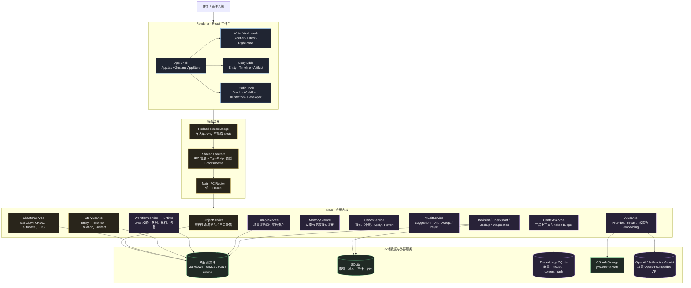

### 3.1 各层职责

| 层 | 主要目录 | 责任 | 不应该做什么 |
| --- | --- | --- | --- |
| Renderer | `src/renderer/src` | 展示状态、收集用户操作、调用 `window.novelAPI` | 不直接访问 Node、文件系统、SQLite 或 API key |
| Preload | `src/preload/index.ts` | 暴露最小且显式的 API；转发 IPC | 不暴露完整 `ipcRenderer`，不承载业务规则 |
| Shared | `src/shared` | IPC 名称、输入输出类型、Zod schema、领域协议 | 不依赖 Electron UI |
| Main IPC | `src/main/ipc.ts` | 参数校验、异常转译、调用服务 | 不把复杂业务全部堆在 handler 中 |
| Domain Services | `src/main/services` | 文件、数据库、AI、上下文、工作流等业务 | 不绕过项目根目录和统一错误边界 |
| Storage | 项目目录 + `.novel/project.db` | 持久化源文件和派生状态 | SQLite 不应成为章节正文唯一来源 |

### 3.2 关键依赖方向

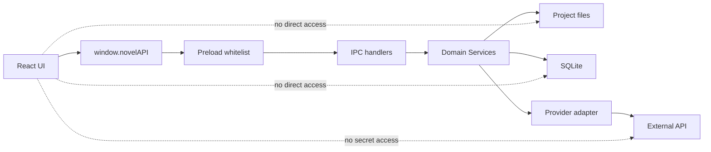

---

## 5. 进程模型与启动过程

Electron 启动后，Main 创建服务实例并把它们注入 IPC 注册函数；Renderer 通过 Preload 获得 `novelAPI`。服务之间的依赖在 `src/main/index.ts` 中显式组装。

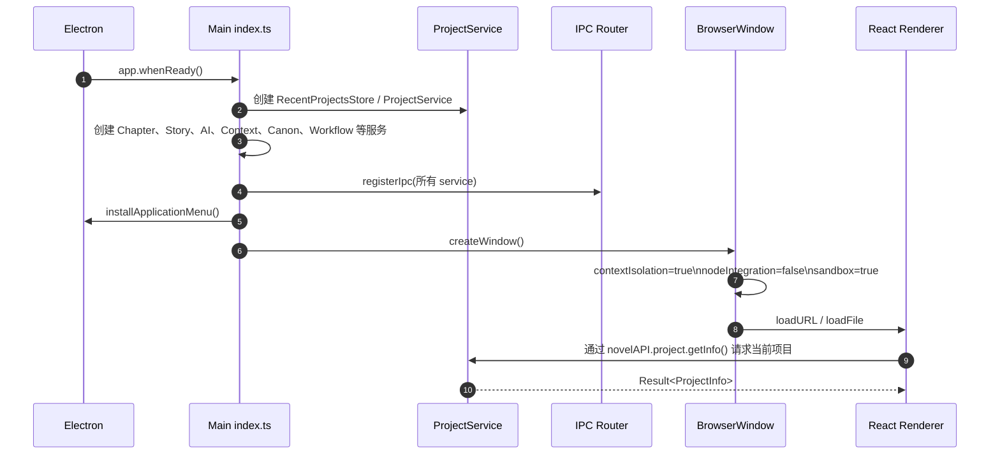

### 4.1 为什么服务在 Main 进程

- 文件系统和项目根目录校验属于受保护能力；
- SQLite 连接和迁移需要集中管理；
- API secret 不能进入 Renderer；
- AI streaming、Workflow Runtime、AbortController 等长任务应由主进程控制；
- Renderer 崩溃或刷新后，项目文件与运行状态仍然可以恢复。

---

## 6. 一次用户操作如何穿过系统

下面以“保存章节”为例。所有 IPC handler 都通过统一 `handle()` 包装：成功返回 `ok(data)`，失败转换为 `AppError`，不会把未处理异常直接抛到 Renderer。

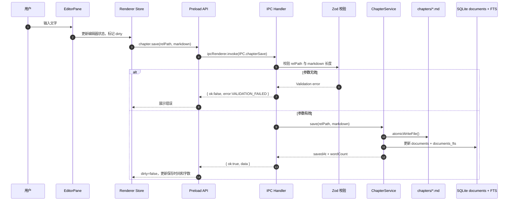

### 5.1 typed IPC 的契约结构

一个功能通常同时存在三份互相对应的定义：

1. `src/shared/ipc.ts`：channel 名称和 API contract；
2. `src/preload/index.ts`：把具体方法映射为 `ipcRenderer.invoke`；
3. `src/main/ipc.ts`：校验 payload，调用 service，统一包装 `Result`。

这能避免 UI 直接依赖 Main 内部类，也让参数校验集中在信任边界。

---

## 7. 项目数据布局：源文件与派生数据

创建项目时，`ProjectService` 建立固定目录，并写入 `novel.yaml`。项目根目录内的相对路径必须通过 `resolveInsideRoot()` 解析，绝对路径和 `..` 穿越会得到 `PATH_DENIED`。

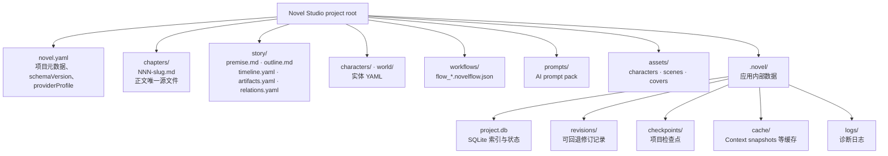

### 6.1 数据归属表

| 数据 | 首要来源 | SQLite 是否有副本 | 重建方式 |
| --- | --- | --- | --- |
| 章节正文 | `chapters/*.md` | `documents` + FTS | 扫描 Markdown，重建 `documents`/FTS |
| 章节标题、字数 | Markdown 标题和正文 | `documents` | 重新读取章节 |
| Story Bible 实体 | `characters/*.yaml`、`world/**/*.yaml` | `entities` | 扫描实体 YAML |
| Timeline | `story/timeline.yaml` | `timeline_events` | 读取 YAML |
| Artifact / Relation | `story/artifacts.yaml`、`relations.yaml` | 对应表 | 读取 YAML |
| Canon facts / proposals | SQLite | 是 | 目前属于应用状态，需通过 Canon API 维护 |
| Embeddings | SQLite `embeddings` | 是 | 读取章节并重新调用 embedding provider |
| Context Snapshot | `.novel/cache/context-snapshots/*.json` + 索引表 | 是 | 读取快照文件或重新 build |
| Revision | `.novel/revisions/*.yaml` + `revisions` 表 | 是 | 以 revision 文件为可审计记录 |
| Workflow 定义 | `workflows/*.novelflow.json` | 运行状态在 SQLite | 读取并校验 JSON |
| Workflow Run / Job | SQLite | 是 | 启动时 `recoverInterrupted()` 处理未完成运行 |

### 6.2 SQLite 的职责

当前迁移包含 `settings`、`documents`、`documents_fts`、`entities`、`timeline_events`、`revisions`、`facts`、`relations`、`proposals`、`workflow_runs`、`node_runs`、`assets`、`ai_suggestions`、`jobs`、`context_snapshots`、`foreshadowing` 和 `embeddings` 等表。

数据库使用：

- `WAL`：提升读写并发和崩溃恢复能力；
- `foreign_keys=ON`：启用关系约束；
- `busy_timeout=5000`：减少短暂锁竞争导致的失败；
- `PRAGMA user_version`：按迁移版本升级。

---

## 8. 章节写作与索引更新

章节保存不是“只写一个文件”：正文先通过原子写入落盘，再更新全文搜索索引；Embedding 索引由独立服务按 hash 增量同步。

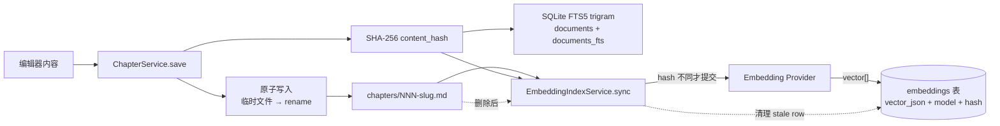

### 7.1 章节索引的两条搜索路径

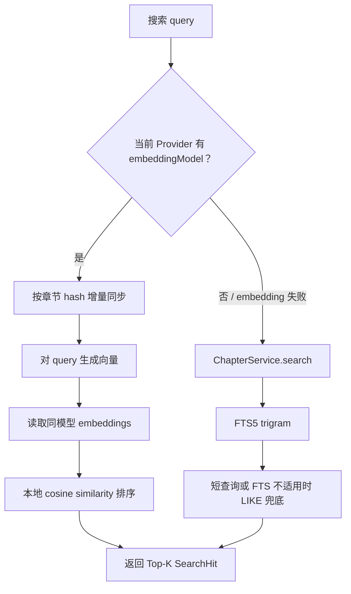

这里没有独立的向量数据库：向量以 JSON 数组存放在项目 SQLite 的 `embeddings` 表中，由应用在本地做 cosine 计算。这样适合当前桌面端、单项目和中小规模章节集；规模显著增长时，向量表扫描会成为主要扩展瓶颈。

---

## 9. Context Engine：如何组装给 AI 的上下文

ContextService 不把所有内容无差别塞给模型，而是按优先级和预算组装三层 Context：

1. **pinned**：当前章节、选区、当前场景；
2. **structured**：实体、Timeline、Canon facts；
3. **semantic**：Embedding 或 FTS 找到的相关章节片段。

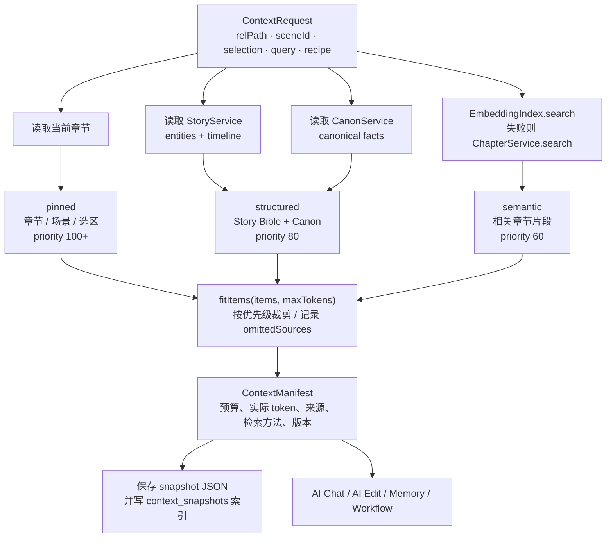

### 8.1 Context Snapshot 的价值

每次 build 都会保存 request、result hash、token 数量、item 来源、项目 schema 版本和 retrieval 版本。它支持：

- 回看当时 AI 看到了什么；
- 对比当前数据重新构建后的变化；
- 当检索算法或 schema 版本变化时进行 replay；
- 限制每章最多 100 个、项目最多 500 个 snapshot，避免无限增长。

---

## 10. Provider、Secret 与模型调用

`AiService` 对上层提供统一的 `chat`、`stream`、`structured` 和 `embed` 能力，底层根据 profile 的 `kind` 选择 Provider adapter。上层不需要知道 OpenAI、Anthropic 和 Gemini 的响应字段差异。

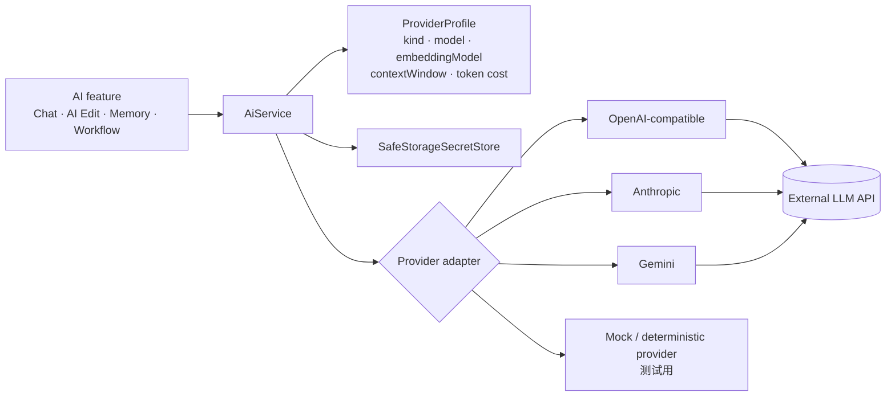

### 9.1 Secret 边界

- Provider profile 只保存非敏感配置，如名称、模型、URL、token 价格；
- API key 由 `SafeStorageSecretStore` 使用 Electron `safeStorage` 加密保存；
- Renderer 只能调用 `hasSecret`、`setSecret`、`removeSecret` 等操作，不能读取真实 secret；
- Provider URL 必须是 HTTPS，本机开发允许 `localhost`/回环地址的 HTTP，且禁止 URL 中包含凭据、query 或 hash。

### 9.2 Token budget

模型上下文窗口不是“越大越好”。`resolveContextBudget()` 会从 `contextWindow` 中扣除预留输出 token 和 256 token 安全余量，再限制 Context recipe 的请求预算。

---

## 11. AI Edit：从生成到可回退修改

AI Edit 使用 Suggestion 作为中间态。生成阶段只产生 `original` 和 `suggested`，只有用户 Accept 才会写回章节并创建 Revision。

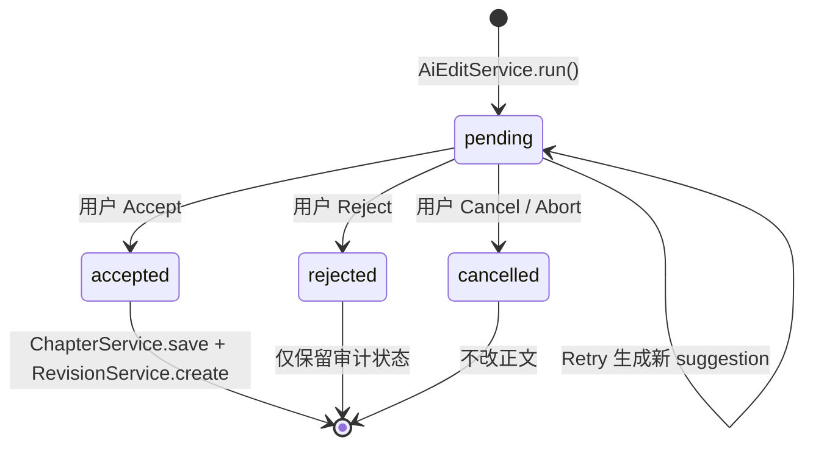

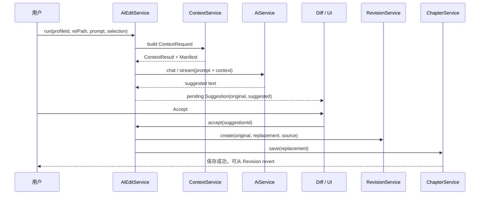

Revision revert 有一个重要保护：如果章节已经发生后续修改，当前正文不再等于 revision 的 replacement，系统拒绝直接覆盖，并要求先查看 Diff。

---

## 12. Memory 与 Canon：AI 建议不等于事实

Memory Extractor 从章节抽取“可能成为 Canon 的事实”，但不会直接写入 canonical facts。它先创建带来源字符范围的 Proposal，再由用户审核。

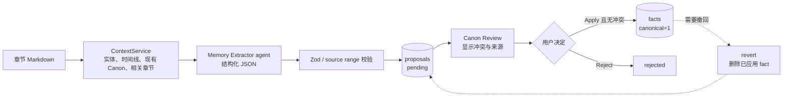

### 11.1 Canon 冲突检查

`CanonService.check()` 会检查：

- `validFrom` 晚于 `validTo` 的时间范围错误；
- 同一 subject + predicate 的不同值；
- 时间范围重叠且值不同的 temporal conflict。

因此，Canon 是“可审计的世界事实层”，不是模型的无条件记忆。模型只能提交建议，应用和用户共同决定事实是否生效。

---

## 13. Workflow：从可视化 DAG 到可恢复执行

Workflow 定义保存为 `workflows/flow_*.novelflow.json`，由 React Flow 编辑器编辑，保存或运行前经过 schema 和 DAG 校验。

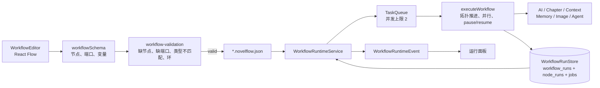

### 12.1 运行状态

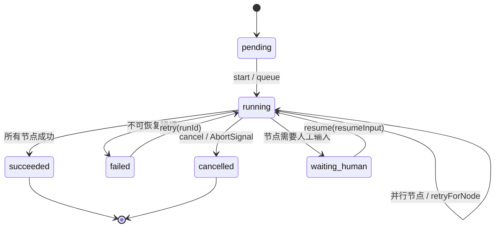

运行状态持久化后，应用重启可以调用 `recoverInterrupted()` 处理未完成记录；节点具备 `attempts`、`idempotencyKey`、诊断信息和输出摘要，便于重试与定位。

### 12.2 Workflow 节点可以做什么

当前运行时包含读取章节、构建 Context、AI/Agent 调用、Memory Extract、图片生成等执行路径。节点执行上下文会携带：

- 上游 `outputs`；
- 节点 `config`；
- `idempotencyKey`；
- 可继承的 Context；
- `AbortSignal`；
- 当前章节路径和场景 ID。

---

## 14. 图片与资产链路

Illustration Studio 从章节或场景生成视觉提案，结合项目 `artDirection`、Story Bible 和场景信息编译 prompt，调用图片 Provider 后把资产元数据写入 SQLite、文件写入项目 `assets/`。

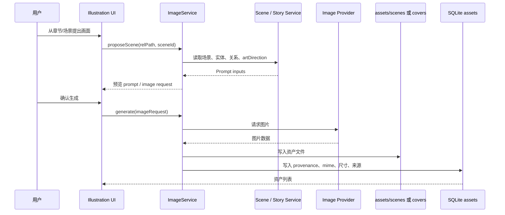

---

## 15. 安全边界与故障处理

### 14.1 安全边界图

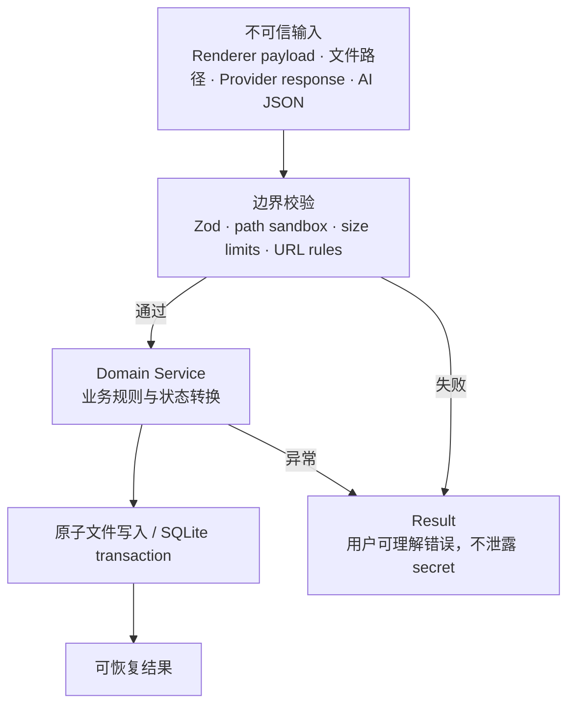

关键措施：

- BrowserWindow：`contextIsolation: true`、`nodeIntegration: false`、`sandbox: true`；
- 阻止 `window.open`、页面导航、重定向和 webview attach；
- 项目内路径统一通过 `resolveInsideRoot()`；
- IPC 输入使用 Zod 校验，章节正文、prompt、路径和 ID 有长度/格式限制；
- API secret 不进入 Renderer，不出现在普通诊断日志；
- 文件采用 atomic write，关键数据库修改使用 transaction；
- AI 结构化输出再次 parse，非法 JSON、反向字符范围和未知实体会失败；
- Provider URL 禁止凭据和 query，生产连接要求 HTTPS。

### 14.2 常见失败和恢复策略

| 失败 | 处理 | 用户看到什么 |
| --- | --- | --- |
| IPC 参数不合法 | `VALIDATION_FAILED`，不调用 service | 参数错误提示 |
| 路径越出项目根 | `PATH_DENIED` | 拒绝访问 |
| Provider 超时/失败 | AI job 或 Workflow node 记录 provider/timeout 错误 | 可 Retry 或切换 profile |
| AI stream 中断 | AbortController 清理 job；Suggestion 不自动覆盖正文 | 保留当前正文 |
| Embedding API 不可用 | 返回 `null`，Context/搜索回落 FTS | 语义搜索不可用但全文搜索仍可用 |
| Embedding hash 过期 | 下次 sync 增量重算 | 不需要手动清空全库 |
| Canon 冲突 | Apply 前阻断 transaction | 显示 conflict，用户处理后再 Apply |
| Workflow 节点失败 | 持久化 node 状态与诊断 | Retry 从失败节点继续 |
| Workflow 需要人工输入 | `waiting_human` 持久化 | Resume 时补充输入 |
| Revision 目标已变化 | 拒绝覆盖 | 要求先查看 Diff |
| SQLite 索引不完整 | integrity check / repair indexes | 从源文件重建索引 |

---

## 16. 典型端到端闭环

这是最能代表产品设计的一条链：用户写作，AI 获得可解释上下文，结果经过人工确认，再沉淀为可检索内容和 Canon 提案。

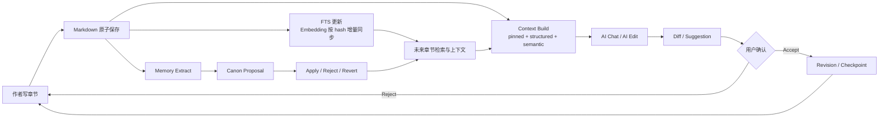

---

## 17. 代码地图

### 16.1 进程入口和桥接

| 文件 | 作用 |
| --- | --- |
| `src/main/index.ts` | Electron 启动、BrowserWindow、安全设置、服务组装、菜单 |
| `src/main/ipc.ts` | IPC handler、Zod 校验、Result/Error 边界 |
| `src/preload/index.ts` | `novelAPI` 和 `novelMenu` 白名单桥接 |
| `src/renderer/src/App.tsx` | Renderer 应用壳与视图组合 |
| `src/renderer/src/store/app-store.ts` | UI 状态和当前工作区状态 |

### 16.2 领域服务

| 服务 | 主要职责 |
| --- | --- |
| `ProjectService` | 创建/打开/关闭项目、manifest、完整性检查、索引修复 |
| `ChapterService` | Markdown 章节 CRUD、场景 sidecar、FTS、导入导出 |
| `StoryService` | Entity、Timeline、Relation、Artifact、foreshadowing |
| `AiService` | Provider profiles、chat、stream、structured、embedding |
| `EmbeddingIndexService` | hash 增量索引、本地 cosine、FTS fallback 的切换入口 |
| `ContextService` | 三层上下文、token fitting、snapshot、replay |
| `MemoryService` | Memory Extractor 输出转 Canon Proposal |
| `CanonService` | Fact、Proposal、冲突检查、Apply、Revert |
| `AiEditService` | Suggestion 状态机、Diff、Accept/Reject/Retry/Cancel |
| `WorkflowService` | `.novelflow.json` 读写与验证 |
| `WorkflowRuntimeService` | DAG 执行、队列、并发、暂停、重试、事件 |
| `ImageService` | 场景 prompt、图片生成、资产 provenance |
| `RevisionService` | 修订记录和安全 revert |
| `CheckpointService` | 项目检查点 |
| `BackupService` | ZIP 备份与恢复 |
| `DiagnosticsService` | 诊断包导出 |

### 16.3 验证与运行命令

```bash
pnpm typecheck
pnpm test
pnpm run build
```

测试使用 deterministic provider 和临时本地项目，不要求真实模型 API key。测试文件覆盖 Project、Chapter、AI、Embedding 相关 Context、Canon、Workflow、Backup、Security 等主要服务。

---

## 18. 架构判断与当前边界

### 17.1 当前方案适合什么规模

当前实现适合：

- 单机、单用户、单项目工作流；
- 章节数量中小规模；
- 需要直接查看和备份 Markdown/YAML 的创作者；
- 需要 AI 但希望人工控制写回和世界观事实的写作者。

### 17.2 未来扩展时最需要关注的点

1. **向量检索扩展性**：当前按 model 读取 embedding rows 并在进程内 cosine 排序；大型项目需要 ANN 索引或专用向量存储。
2. **长任务调度**：当前 `TaskQueue` 并发上限为 2，若引入更多后台任务，需要统一资源配额和取消语义。
3. **多项目并行**：当前 service 依赖一个当前打开的 `ProjectService`，多窗口/多项目需要重新定义 project context 生命周期。
4. **Provider 能力差异**：不同供应商的 tool calling、structured output、视觉输入和流式语义仍需在 adapter 层统一。
5. **Canon 数据迁移**：正文和 Story YAML 有明确文件源，Canon facts 目前主要在 SQLite，长期需要考虑可导出/可迁移格式。
6. **可观测性**：Workflow 已有 node diagnostics、usage、cost 和 logs，未来可统一 request correlation id 和脱敏事件追踪。

### 17.3 不应轻易破坏的架构约束

- 不让 Renderer 直接拥有文件系统或网络 secret 能力；
- 不把 Markdown 正文改成 SQLite 唯一来源；
- 不让 AI 结果跳过 Suggestion/Revision/Canon 审核直接覆盖事实；
- 不绕过 `resolveInsideRoot()` 写项目文件；
- 不把 Provider-specific response 结构泄露给所有上层服务；
- 不在失败时静默吞掉错误，至少要返回可分类的 `AppError`。

---

## 19. 术语表

| 术语 | 简单解释 |
| --- | --- |
| Renderer | Electron 中负责界面显示的 React 页面进程 |
| Main | Electron 中拥有文件、数据库和网络权限的主进程 |
| Preload | 连接 Renderer 与 Main 的受控桥梁 |
| IPC | 两个 Electron 进程之间传消息的机制 |
| Source of truth | 真实数据的最终来源；本项目正文主要是 Markdown/YAML |
| FTS | Full-Text Search，全文搜索；当前使用 SQLite FTS5 |
| Embedding | 把文本转换为数字向量，用于按语义相似度检索 |
| Context | 一次 AI 请求实际携带的章节、实体、事实和检索片段 |
| Recipe | Context 的预算和组成规则 |
| Canon | 经确认的世界观事实，如角色状态、关系和时间条件 |
| Proposal | AI 或用户提出、等待审核的 Canon 事实 |
| Revision | 一次可审计、可回退的正文修改记录 |
| Workflow | 由节点和边组成的可视化自动化流程定义 |
| Runtime | 读取 Workflow 定义并实际执行节点的运行时 |
| Idempotency key | 标识一次节点执行，帮助重试时避免重复副作用 |

---

## 附：相关架构图

如果只想快速看一张图，可打开：

- [Novel Studio 架构图 SVG](./novel-studio-architecture.svg)
- [Novel Studio 架构图 PNG](./novel-studio-architecture.png)

本文中的 Mermaid 图更适合在 GitHub、VS Code、Obsidian 或支持 Mermaid 的 Markdown 阅读器中逐图查看。
