# 《雾港来信》：Novel Studio 完整使用手册

> 面向第一次使用 Novel Studio 的作者。本文以一部 3–5 万字的都市悬疑中篇《雾港来信》为例，从创建项目开始，走完故事地基、Story Bible、逐章写作、AI 协作、Workflow、人工审核、Canon、插画、全稿修订和终稿导出。

## 阅读说明

- 本手册对应当前工作区中的 Novel Studio 原型版本，界面可能随开发版本变化。
- 文中截图均来自当前 Electron 界面。`01`–`11` 主要使用《雾港来信》演示项目；`12`–`21` 使用隔离的临时 Tiny CN fixture 验证真实的 Workflow、人工门禁和导出状态。
- 截图中的 Mock Provider 只返回确定性演示结果，不需要真实 API Key。正式写作时请替换成自己的 Provider，并在截图或日志中不要暴露密钥。
- Novel Studio 是本地优先工具：Markdown/YAML 是可读的项目源文件，SQLite 主要用于索引、搜索和运行时状态。正文、Canon 和 AI 建议不是同一种数据，写回前必须人工确认。

## 你将完成的路线

```text
创建项目 → 填写 Premise/大纲 → 配置 Provider → 建立 Story Bible
       → 章节计划 → Context → 写作 → 三类审阅 → 合并/重写
       → Human Review → 写回 → Memory/Canon → 插画门禁
       → 全书检查 → 全稿修订 → 导出 Markdown 终稿
```

---

# 第一章：创建项目与基础配置

## 1.1 前置条件与启动

建议环境：Node.js 22+、pnpm 10+。在项目根目录执行：

```bash
pnpm install
pnpm dev
```

如果需要使用稳定 Electron 窗口或采集和本文一致的桌面界面，先构建再启动：

```bash
npm run build
pnpm dev:stable
```

如果稳定启动提示 Electron 原生运行时缺失，先执行 `pnpm rebuild electron`，然后再次构建。不要因为这个提示就删除用户目录或整个 `node_modules`；也不要把 Electron 的卸载当作日常修复步骤。只有确认依赖安装损坏时，才针对当前项目重新安装 Electron 依赖，并保留 `pnpm-lock.yaml`，避免把无关依赖升级到未验证版本。

代码、测试和构建验证：

```bash
pnpm typecheck
pnpm test
pnpm build
```

首次启动会进入欢迎页。欢迎页提供四类入口：创建新项目、打开已有项目、从备份恢复、打开最近项目。

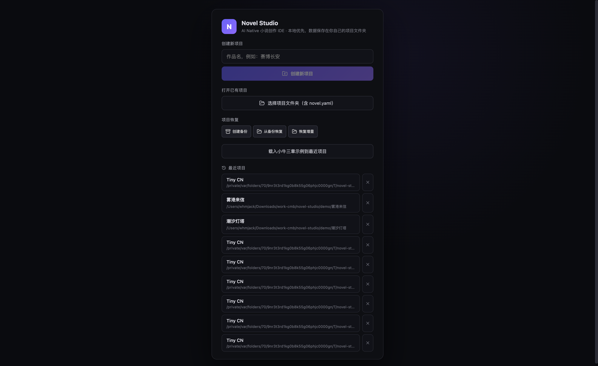

### 欢迎页的按钮含义

| 入口 | 用途 | 注意事项 |
| --- | --- | --- |
| 创建新项目 | 在一个空目录初始化小说工程 | 建议为每部小说单独建目录；目录最好为空 |
| 打开已有项目 | 打开含 `novel.yaml` 的项目目录 | 不要选择只包含若干 Markdown 的普通文件夹 |
| 创建备份 / 从备份恢复 | 对项目做 ZIP 级别的备份和恢复 | 恢复前确认目标目录，避免覆盖错误项目 |
| 最近项目 | 快速回到最近打开的工程 | 最近项目只保存路径，不代替备份 |

## 1.2 创建《雾港来信》

1. 在“创建新项目”的输入框输入项目名：`雾港来信`。
2. 点击“创建新项目”。
3. 在系统目录选择器中选择一个空目录，例如 `~/Documents/NovelProjects/雾港来信`。
4. 选择目录后，Novel Studio 会打开“新建小说创作流程”向导。

如果目录不是空目录，或里面已经有正文，初始化可能被拒绝。此时可以返回欢迎页，改选一个新目录；不要为了通过初始化而删除已有作品。

## 1.3 初始化向导：每个字段怎么填

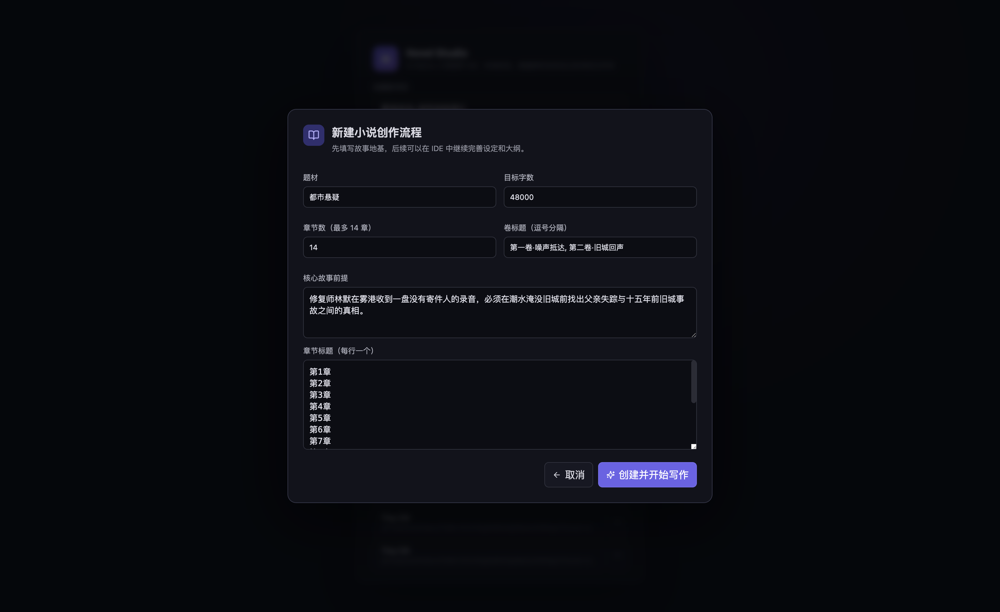

向导是项目的第一道故事地基。它会创建章节、卷、`story/premise.md`、`story/outline.md`，并安装默认创作 Workflow。

| 字段 | 《雾港来信》示例 | 填写规则与影响 |
| --- | --- | --- |
| 题材 | `都市悬疑` | 用于确定创作语境。可以写“科幻悬疑”“古代言情”等组合题材 |
| 目标字数 | `48000` | 用于全书进度、章节目标和低字数警告；不是硬性自动截断值 |
| 章节数 | `14` | 当前向导最多 14 章；输入数量变化时章节标题会同步增删 |
| 卷标题 | `第一卷·噪声抵达, 第二卷·旧城回声` | 使用英文逗号分隔。初始化后可在左侧目录继续调整 |
| 核心故事前提 | 见下方 Premise | 写清主角、目标、阻力、时间压力和悬念，不要只写一句题材标签 |
| 章节标题 | 每行一个标题 | 行数必须和章节数相同；标题会成为 Markdown 文件名的一部分 |

推荐 Premise：

```text
修复师林默在雾港收到一盘没有寄件人的录音，必须在潮水淹没旧城前找出父亲失踪与十五年前旧城事故之间的真相。
```

推荐 14 个章节标题：

```text
录音里的求救声
没有寄件人的包裹
回放噪声的人
潮线以下
修复一段沉默
父亲的借据
雾港不记录夜晚
顾深的条件
第二个门
失真的证词
谁在保存真相
潮水进门
回放之前
雾散之后
```

点击“创建并开始写作”前逐项检查：

- 题材和 Premise 已填写；
- 目标字数是整数且大于 0；
- 章节数在 1–14；
- 卷标题至少有一项；
- 章节标题不为空，且正好有 14 行；
- Premise 没有写入真实 API Key、密码或私人路径。

初始化完成后，可以在项目目录看到类似结构：

```text
雾港来信/
├── novel.yaml
├── chapters/
│   ├── 001-录音里的求救声.md
│   └── ...
├── story/
│   ├── premise.md
│   ├── outline.md
│   ├── volumes.yaml
│   ├── timeline.yaml
│   ├── artifacts.yaml
│   └── relations.yaml
├── characters/
├── world/
├── prompts/
├── workflows/
└── .novel/
```

`.novel/` 保存索引、运行记录、检查点和缓存。它不是替代源文件的“黑盒数据库”；正文和故事资料仍应以项目中的 Markdown/YAML 为准。

## 1.4 初次进入工作台

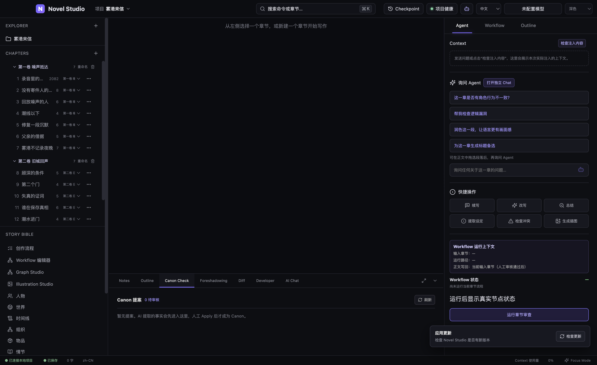

工作台可以按三个区域理解：

1. 左侧 Explorer：项目名、卷、章节和 Story Bible 入口。
2. 中央编辑区：正文、Story Bible、创作流程、Workflow、Graph、Illustration Studio 等主视图。
3. 右侧 Agent：Context、询问 Agent、快捷操作和 Workflow 运行状态。

底部状态栏显示连接状态、保存状态、当前字数、语言和 Context 使用量。看到“已保存”后再关闭项目或切换章节。

常用全局控制：

- 顶部项目菜单：创建备份、增量备份、项目归档、导入归档、修复索引、关闭项目；
- 顶部搜索框：打开命令面板，也可以搜索章节和 Story Bible 结果；
- `Checkpoint`：为当前状态创建命名检查点；
- “项目健康”：只读检查源文件、引用和索引的一致性；
- 语言下拉框：中文 / English；
- 主题下拉框：跟随系统 / 深色 / 浅色；
- 顶部模型按钮：打开 Provider 设置。

## 1.5 配置 LLM Provider

点击顶部的模型按钮，打开 Provider 设置。

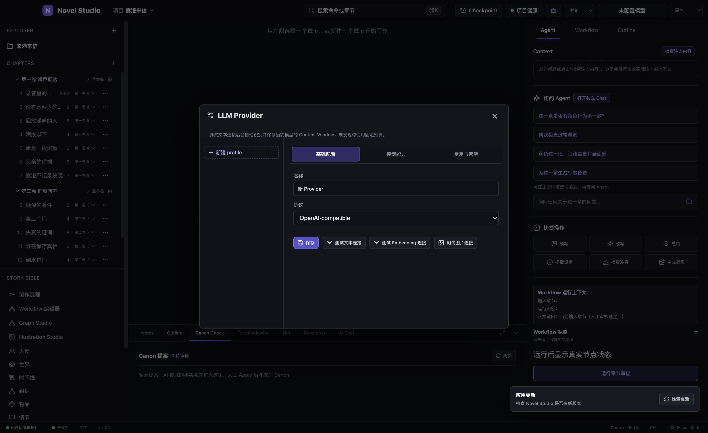

设置窗口分为“基础配置”“模型能力”“费用与密钥”三个标签页。先在基础配置中创建 profile，再填写模型能力，最后保存并测试。

### 基础配置

| 项目 | 示例 | 说明 |
| --- | --- | --- |
| 名称 | `雾港写作 Provider` | 只是本地 profile 名称，建议包含用途 |
| 协议 | `OpenAI-compatible` | 也可以选择 Anthropic、Gemini 或 Mock |
| 当前 | 使用 profile 列表里的“使用” | 只有当前 profile 才会被写作 Workflow 使用 |

截图演示使用 Mock profile，是为了让文档中的 AI 结果可重复；正式使用时可以选择 OpenAI-compatible 或其他支持的协议。

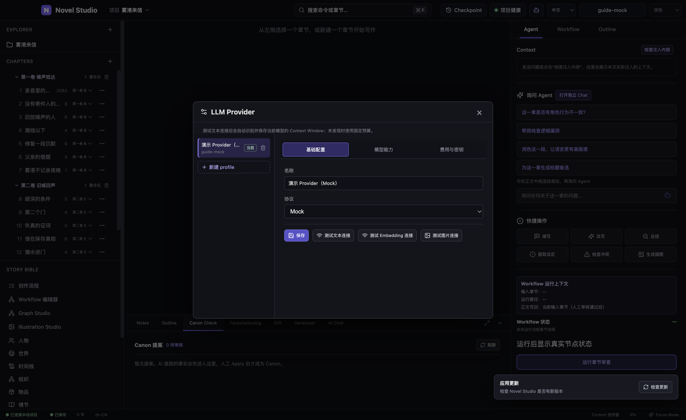

### 模型能力

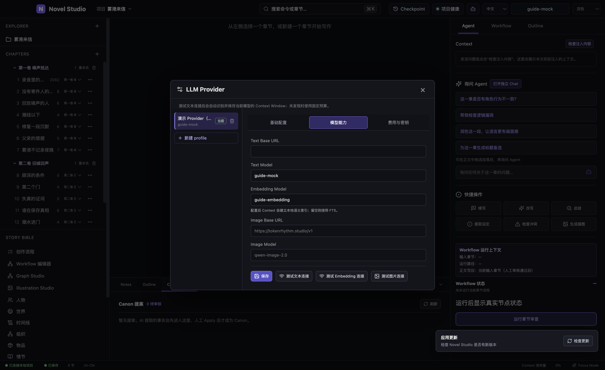

需要逐项确认：

- Base URL：使用 HTTPS；本机开发才使用 localhost/127.0.0.1 的 HTTP；不要把 Key 放进 URL、用户名、密码或 query 参数。
- 文本模型：例如 `gpt-4o-mini`。模型名称必须是 Provider 实际支持的 ID。
- Embedding 模型：用于语义搜索和 Context 检索。没有时可以先留空，但检索能力会受限。
- 图片 Base URL / 图片模型：Illustration Studio 使用；不做插画时可以暂不配置。
- Context Window：点击“测试文本连接”后，应用会尝试从模型信息识别；识别不到时使用固定预算。

### 费用与密钥

这里可以填写输入/输出 token 单价，也可以填写文本 API Key 和图片 API Key。密钥通过应用的 secret store 保存，不写入 `novel.yaml`。保存后通常只显示“已配置”，不会再显示原文。

建议顺序：

1. 保存 profile；
2. 点击“测试文本连接”；
3. 如果使用 Embedding，点击“测试 Embedding 连接”；
4. 使用插画时再点击“测试图片连接”；
5. 确认顶部模型按钮已经显示目标模型。

测试失败时先看 URL、模型 ID、密钥权限和网络代理，不要把密钥复制到聊天记录或 issue。

---

# 第二章：故事资料、章节写作与 AI Workflow

## 2.1 先建立 Story Bible

Story Bible 用来保存跨章节会复用的稳定资料。它不是正文的附属备注，而是 Agent 构建 Context 时可以检索的结构化事实。

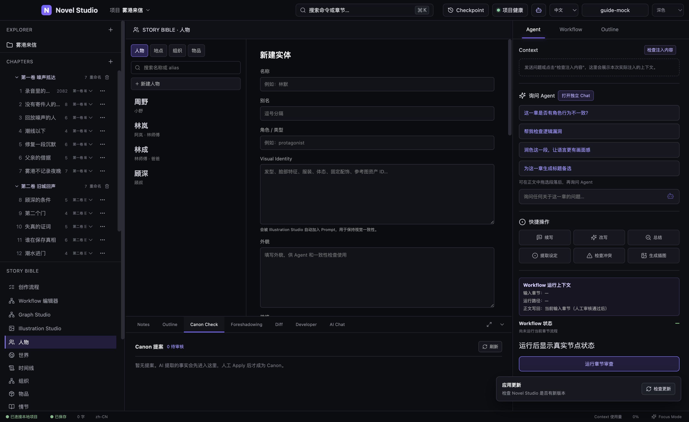

当前可以维护：

- 人物：姓名、别名、外貌、性格、目标、秘密、已知信息、状态、Notes；
- 地点：空间特征、可进入条件、与章节的关系；
- 组织：组织目标、成员、立场和资源；
- 物品：道具属性、来源、持有人和使用限制；
- 设定 / Lore：世界规则、适用范围和例外；
- 情节 / Plot：主线、支线、状态、优先级、铺垫与回收；
- 伏笔：setup、target、deadline、status 和证据；
- Notes：不一定进入 Canon 的工作笔记。

### 建议先录入的《雾港来信》资料

至少创建以下人物：

| 人物 | 别名 | 目标 | 秘密 |
| --- | --- | --- | --- |
| 林默 | 林师傅 | 找出父亲失踪真相 | 她曾经删掉一段旧录音 |
| 林诚 | 爸爸、林师傅 | 掩盖或保护事故相关证据 | 留下了“第二个门”的线索 |
| 顾深 | 顾叔 | 用旧钥匙交换利益 | 知道旧港区档案的缺口 |
| 周野 | 小野 | 帮林默追踪包裹来源 | 见过灰雨衣来客 |

创建人物的基本步骤：

1. 点击左侧“人物”；
2. 点击“新建人物”；
3. 填写名称和别名；
4. 在字段中写目标、秘密、已知信息和当前状态；
5. 如果人物会出现在插画中，补充 Visual Identity；
6. 点击“保存”，确认列表中能再次打开并回显。

重要原则：人物的事实应写成可验证的陈述。例如“林默害怕录音被公开”比“她很复杂”更适合被 Agent 检索。

## 2.2 维护时间线、关系和伏笔

时间线事件把“什么时候、在哪里、谁参与、发生了什么、原因和结果”放在一起。

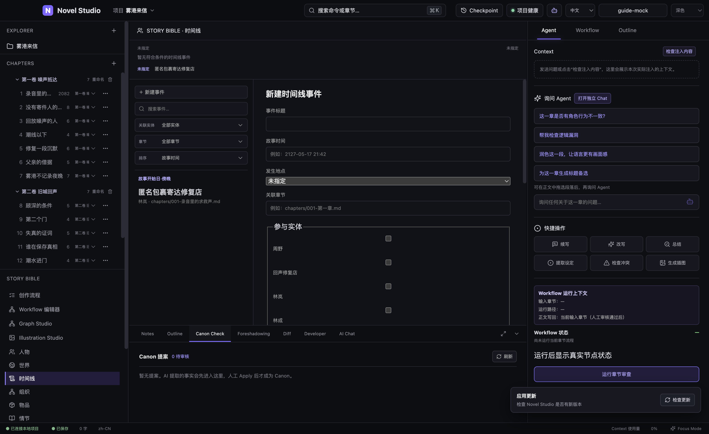

新建时间线事件：

1. 点击左侧“时间线”；
2. 点击“新建事件”；
3. 填写事件标题和故事时间；
4. 选择发生地点、关联章节和参与实体；
5. 写清“事件原因”和“事件结果”；
6. 填写描述并保存；
7. 重新点开事件，检查参与者、地点、原因和结果是否回显。

《雾港来信》的第一条时间线可以是：

```text
标题：匿名录音抵达
时间：第 1 天·夜
地点：回声修复店
章节：第 1 章《录音里的求救声》
参与者：林默、周野
原因：父亲失踪留下线索
结果：林默开始追查旧港区
```

关系图用于表达“盟友”“父女”“交易对象”“宿敌”等实体之间的关系。关系修改后应重新点开检查回显；删除关系不会自动删除两端实体。

伏笔建议在开始写正文前登记：

```text
标题：灯塔下的第二个门
Setup：录音提到灯塔下的第二个门
Target：进入地下空间并确认录音来源
Payoff deadline：第 9 章前
Status：planned → planted → echoed → resolved
Evidence：填写回收伏笔的章节和原文摘录
```

只有真正回收、明确放弃或经过人工判断的伏笔，才把状态改成 `resolved` 或 `abandoned`。未回收伏笔会在全稿修订阶段形成阻塞错误。

## 2.3 故事地基和三幕大纲

进入左侧“创作流程”，顶部的“故事地基”区域会显示 `story/premise.md` 和 `story/outline.md` 两个可编辑文本框。

推荐三幕结构：

```markdown
# 全书大纲

## 第一幕：噪声抵达
- 林默收到匿名磁带，确定父亲失踪不是普通离家。
- 灰雨衣、旧邮局和 L.C. / 07 成为第一组线索。

## 第二幕：逼近旧城回声
- 林默追查潮汐测绘记录和旧港档案。
- 顾深提出交换条件，证据开始指向事故当夜。

## 第三幕：第二个门
- 林默进入灯塔地下空间，确认父亲保护过受害者。
- 公开经过验证的事实，接受仍有无法追回的过去。
```

点击“保存故事地基”后，应用会重新计算 Premise、Story Bible、Outline 和章节计划阶段。大纲中的章节标题最好使用 `### 第1章 ...` 这种标题格式，便于阶段检查识别章节数。

## 2.4 章节目录和正文编辑

左侧章节区支持：

- 点击章节打开正文；
- 顶部加号创建新卷或新章节；
- 双击卷名或点击“重命名”修改卷名；
- 章节菜单可以重命名、移动或删除章节；
- 删除卷前要先把卷内章节移出；
- 删除章节会删除正文，但 Revision、Canon 和 Workflow 历史按设计保留。

正文是 Markdown 源，编辑器会提供标题、加粗、斜体、列表、任务项和引用等常用操作。输入后等待底部状态变为“已保存”。自动保存失败时不要继续大量输入，先查看通知并保留当前文本。

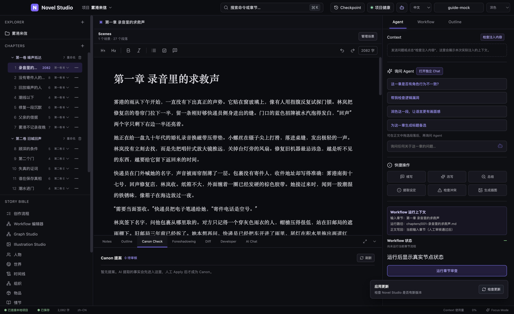

章节底部标签包括 Notes、Outline、Canon Check、Foreshadowing、Diff、Developer 和 AI Chat：

- Notes：当前章节的工作备注；
- Outline：章节目标、冲突和 beats；
- Canon Check：查看 AI 提取的事实提案；
- Foreshadowing：查看铺垫、回收和证据；
- Diff：对比草稿与当前正文；
- Developer：运行、节点、Job 和脱敏诊断；
- AI Chat：围绕当前章节继续追问。

## 2.5 在右侧 Agent 中使用 Context

右侧 Agent 的 Context 区显示本次请求实际注入了哪些来源。点击“检查注入内容”可以在发送前检查；不要把“我以为 Agent 看到了什么”当成事实，要以这里显示的来源为准。

常用提示词示例：

```text
请只根据当前章节和 Story Bible，列出林默已经知道的事实、仍然未知的事实，以及本章不能提前揭示的谜团。
```

```text
检查本章是否出现人物行为不一致。按“原文位置 / 冲突事实 / 建议”输出，不直接改写正文。
```

```text
检查旧邮局、灰雨衣、L.C. / 07 和灯塔第二个门之间的因果链，指出证据不足的位置。
```

一个合格的 Context 请求应明确：范围、任务、输出格式和不能改变的事实。例如不要只输入“润色一下”，而要说明视角、语气、字数和必须保留的线索。

## 2.6 选区改写、Suggestion 和独立 Chat

在正文中拖选一段后，选择工具条中的“选中”，再执行 Agent 操作。AI 返回的建议先进入 Suggestion/Diff，不会自动覆盖原文。

处理建议时：

1. 阅读原文和建议文本；
2. 检查人物、时间线、证据和叙事视角；
3. 需要修改时选择“编辑后通过”；
4. 接受可用建议时选择 Accept/接受；
5. 不合适时选择 Reject/拒绝；
6. 只有确认后的内容才可以写回章节。

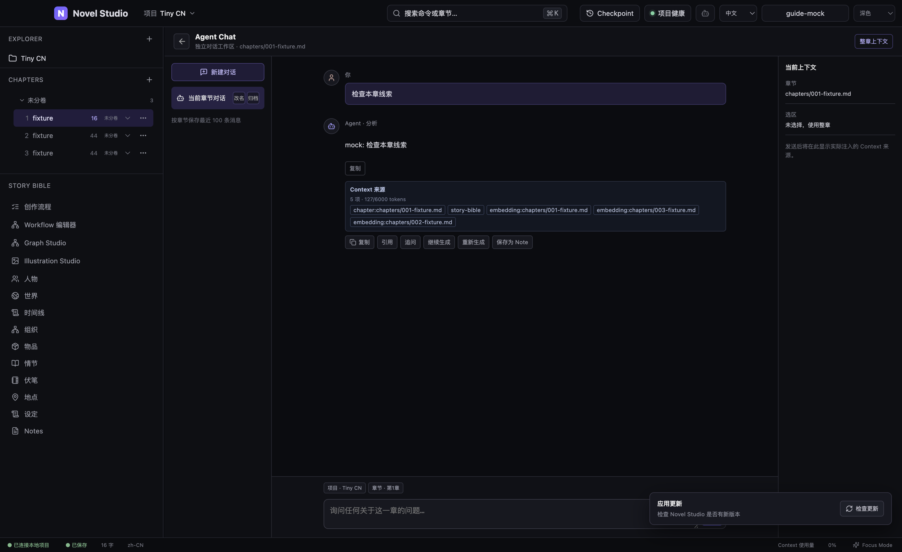

“打开独立 Chat”适合长问题、连续追问和整章分析。截图中的示例显示了：当前项目、当前章节、选区范围、实际 Context 来源、复制、引用、追问、继续生成、重新生成和保存为 Note。独立 Chat 的回答不会自动写入正文；要改正文，必须从 Diff 动作回到编辑器。

## 2.7 Illustration Studio

插画工作台分三步：Visual Setup、Scene Proposal、Review & Insert。

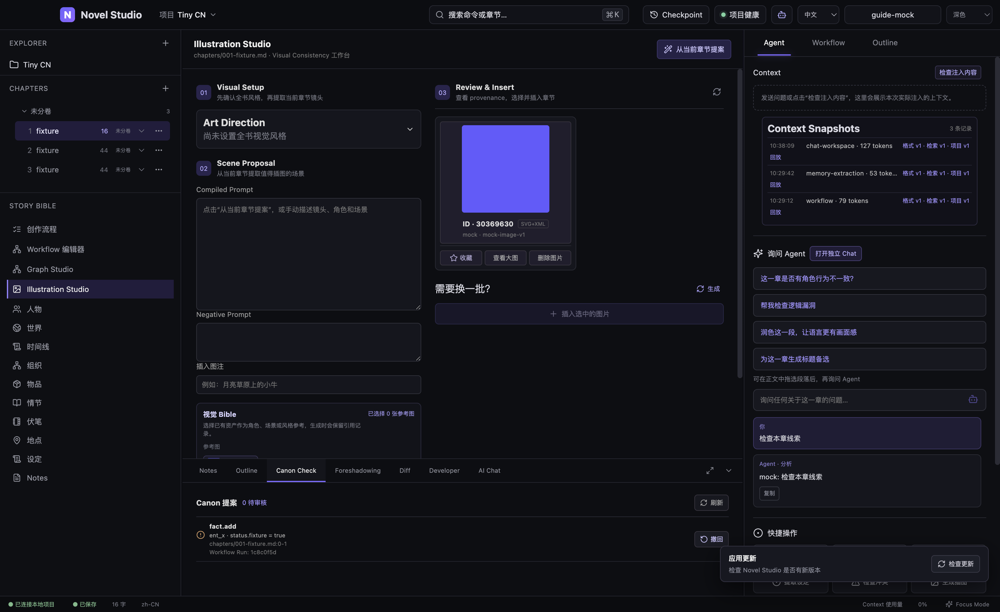

使用流程：

1. 先设置全书 Art Direction，例如“潮湿旧城的铅灰天光、修复店里的暖黄台灯与磁带噪声；都市悬疑写实，人物造型和道具保持连续”；
2. 从当前章节提取可插画场景；
3. 检查 Compiled Prompt 和 Negative Prompt；
4. 选择角色、地点和风格参考图，形成 Visual Bible；
5. 选择 1–4 张变体并生成；
6. 查看资产 ID、Provider、Model 和 provenance；
7. 选中合适资产，再插入当前章节；
8. 不合适的资产可以删除，删除前确认它没有被其他章节引用。

Workflow 中的 `image.select` 也是人工门禁。生成图片不等于插入正文，必须明确选图后才会继续。

## 2.8 使用 Workflow 编辑器

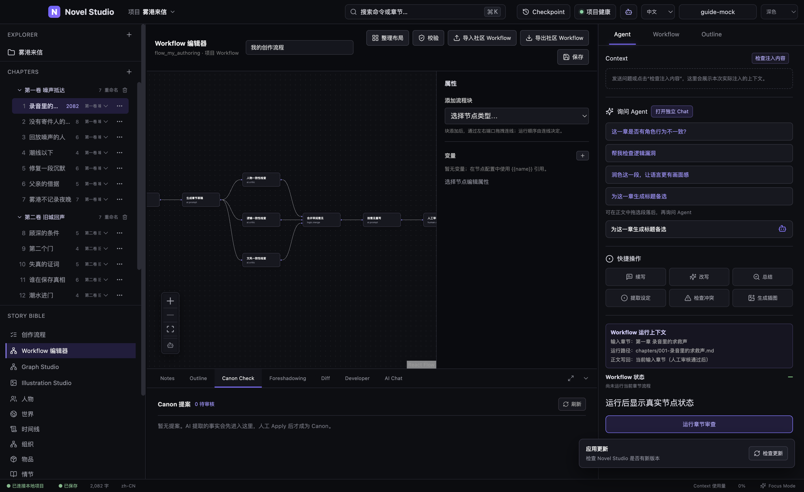

Workflow 编辑器把写作步骤表示成有输入、输出和连接线的节点。默认的中篇创作路径是：

```text
读取当前章节
 → 构建 Context
 → 章节规划
 → 生成章节草稿
 → 人物一致性检查 ┐
 → 逻辑一致性检查 ├→ 合并审阅意见 → 按意见重写
 → 文风一致性检查 ┘                         ↓
                                      人工审核
                                           ↓
                                      写回当前章节
                                           ↓
                                      提取候选事实
```

涉及插画时，在写回和 Memory 前后还可以增加：图片提案、编译图片提示词、生成图片、人工选图和插入正文。

编辑 Workflow 的步骤：

1. 在左侧打开 Workflow 编辑器；
2. 选择项目 Workflow；
3. 从“添加流程块”选择节点类型；
4. 填写节点的 Agent、Prompt 或其他配置；
5. 从左右端口拖拽连线；
6. 点击“校验”，修复缺少输入、孤立节点、类型不匹配或循环；
7. 保存 Workflow；
8. 在当前章节上运行前，再检查运行路径和写回目标。

建议把 Prompt 写成职责单一的任务：规划节点只规划，写作节点只写正文，审稿节点只列问题，重写节点才根据意见改稿。这样更容易定位失败，也便于重试单个节点。

## 2.9 一章的标准执行模板

对 14 章逐章重复下面的模板。每一章都要保留自己的 Context、计划、审阅和人工决定，不要为了追求速度跳过门禁。

### A. 写前准备

- 打开目标章节；
- 在 Outline 中写目标、冲突、转折、场景 beats 和结尾钩子；
- 检查该章需要的人物、地点、道具和已确认 Canon；
- 用 Context 检查注入来源。

### B. AI 草稿和三类审阅

- `plot-planner`：输出本章规划；
- `writer`：只输出可审核正文，不提前解决主谜团；
- `character-critic`：检查目标、恐惧、秘密、关系和已知信息；
- `logic-critic`：检查因果、时间、空间、证据和信息释放；
- `style-critic`：检查视角、节奏、重复、感官细节和语气；
- `logic.merge`：合并三类审阅意见；
- `rewrite`：按意见重写，并保留未揭示的主谜团。

### C. 人工审核和写回

1. 先读原稿、三类审阅意见和重写稿；
2. 错误、幻觉、越界揭示或风格不合适时拒绝；
3. 需要手改时选择“编辑后通过”；
4. 确认后选择“通过并写回”；
5. 写回完成后重新打开章节，确认正文真的更新；
6. 再查看 Canon Check，把新事实当作“候选”而不是既定事实。

### D. 插画和 Memory

- 有插画需求时，先通过图片提案和人工选图；
- 选图后才插入正文；
- Memory 提取出的事实仍需在 Canon Check 中 Apply；
- 将当前章节状态刷新为 approved 或 revised 后再进入下一章。

---

# 第三章：审核门禁、Canon、全稿修订与交付

## 3.1 Workflow 的两个 Human Review 门禁

运行章节审查后，右侧 Workflow 状态会显示各节点进度。写作 Workflow 至少有两类人工暂停：正文审核和图片选择。


### 正文审核暂停

当当前节点为 `review` 时，界面会显示草稿待人工处理，并提供：

- 拒绝本次草稿：运行停止或进入失败/拒绝路径，正文不写回；
- 编辑后通过：先人工修改，再进入后续节点；
- 通过并写回：确认 AI 草稿，执行 `chapter.write`。

“通过”不是对 AI 的无条件信任，而是作者对本次写回负责。审核至少要检查：

1. 是否符合章节计划；
2. 人物的目标、关系和已知信息是否连续；
3. 时间线和空间移动是否自洽；
4. 是否提前泄露本章之后才应揭示的事实；
5. 是否混入了 Prompt、JSON、系统说明或别的章节正文；
6. 是否出现不希望写入正文的摘要、评语或工具输出。

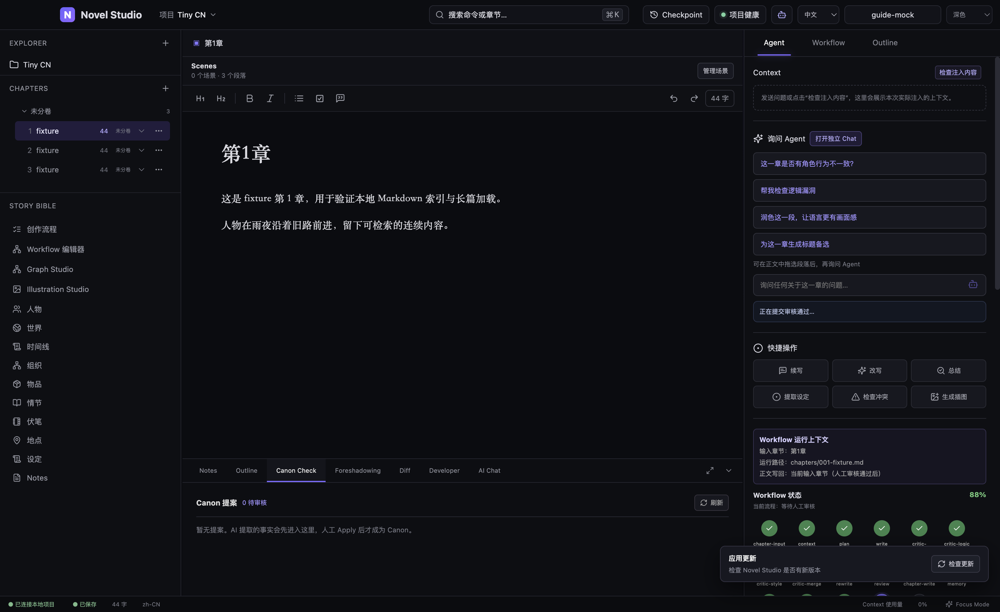

### 图片选择暂停

当当前节点为 `image-select` 时，生成的图片已经存在为资产，但尚未插入正文。阅读图片的 provenance、提示词和来源，选择合适变体后才继续。

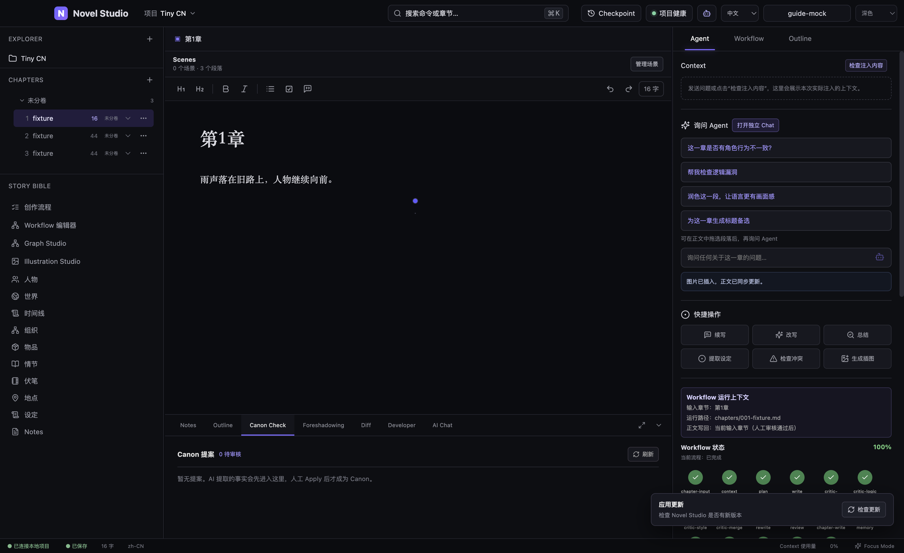

只有所有必需节点显示完成，Workflow 才能进入 succeeded。看到 completed 后仍应重新打开章节检查写回结果，因为“运行成功”和“文学质量合格”是两个不同判断。

## 3.2 Canon Check：从候选事实到既定事实

AI 的 Memory 节点会把可能的新事实放进 Canon Check。它们默认是 pending，不会自动成为故事真相。

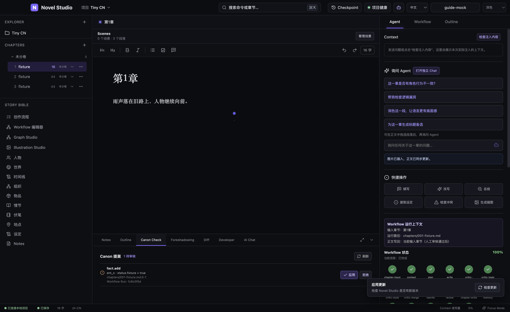

处理一条提案：

1. 查看 subject、predicate、object；
2. 打开来源章节和字符范围；
3. 判断原文是否真的支持这个事实；
4. 点击“应用”使其成为 Canon，或点击“拒绝”丢弃；
5. 如果应用后发现判断错误，可以点击“撤回”；
6. 刷新 Canon Check，确认待审核数量下降。

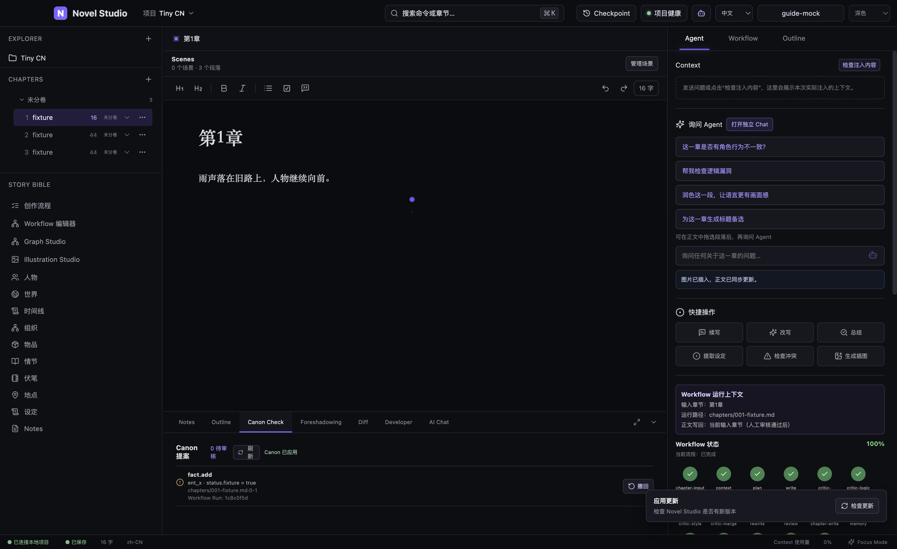

例如“林默在第 1 章得知 L.C. / 07”可以成为事实；“林诚一定还活着”如果只是角色猜测，就不应直接 Apply。Canon 过早写入会影响后续章节的 Context，因此宁可保守，也不要把推测当成真相。

未处理的 pending Canon 会阻止下一轮章节 Workflow，也会阻止全稿修订和导出。处理提案后记得刷新创作流程进度。

## 3.3 全书检查与全稿修订

进入“创作流程”，先点击“刷新进度”，再点击“检查全书”。检查会汇总：

- 章节总数、已审核章节数和正文长度；
- 空章节和未人工审核章节；
- pending Canon；
- Story Bible 是否有角色/实体、时间线和伏笔；
- 章节编号和顺序；
- 源文件、引用和 SQLite 索引完整性；
- 单章和全书字数警告；
- 全稿修订是否已完成。

错误和警告要区别处理：错误会阻止导出，警告通常允许继续，但代表作者仍应人工检查。

点击“开始全稿修订检查”后，应用会生成一份带 report ID 的全稿报告。报告是“待人工通读确认”，不是自动润色全文。

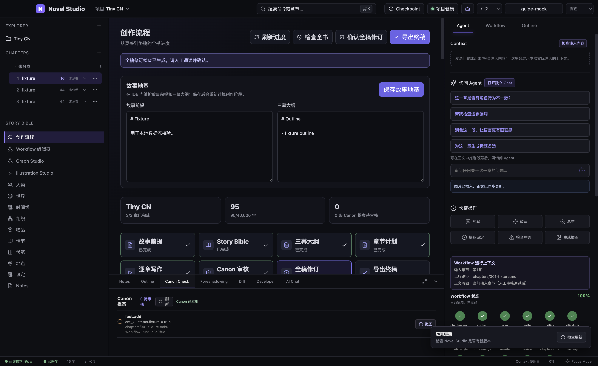

### 全稿修订通过前的检查表

- 每一章都有正文；
- 每一章都通过了 Human Review，状态是 approved 或 revised；
- 角色和实体资料已经建立；
- 时间线至少有一个事件，且章节引用有效；
- 伏笔已回收或明确标记 abandoned；
- Canon pending 数量为 0；
- 项目健康检查没有缺失文件、悬空关系或无效源文件；
- 章节顺序连续；
- 低字数警告已经由作者判断是否可接受。

报告通过后点击“确认全稿修订”。系统会把阶段推进到导出，生成的报告会被保存在项目检查点目录中。确认前如果项目发生变化，应重新准备报告。

## 3.4 导出终稿

全书检查通过并确认全稿修订后，“导出终稿”按钮会变为可用。

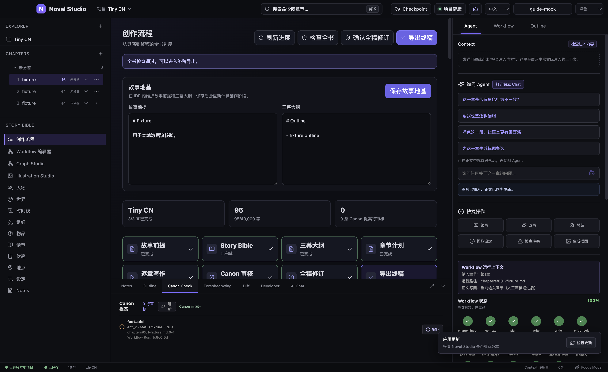

点击“导出终稿”，在系统保存对话框中选择目标路径。导出结果默认是合并后的 Markdown 文件，并保留章节顺序。应用会在导出成功后记录目标路径和导出状态。

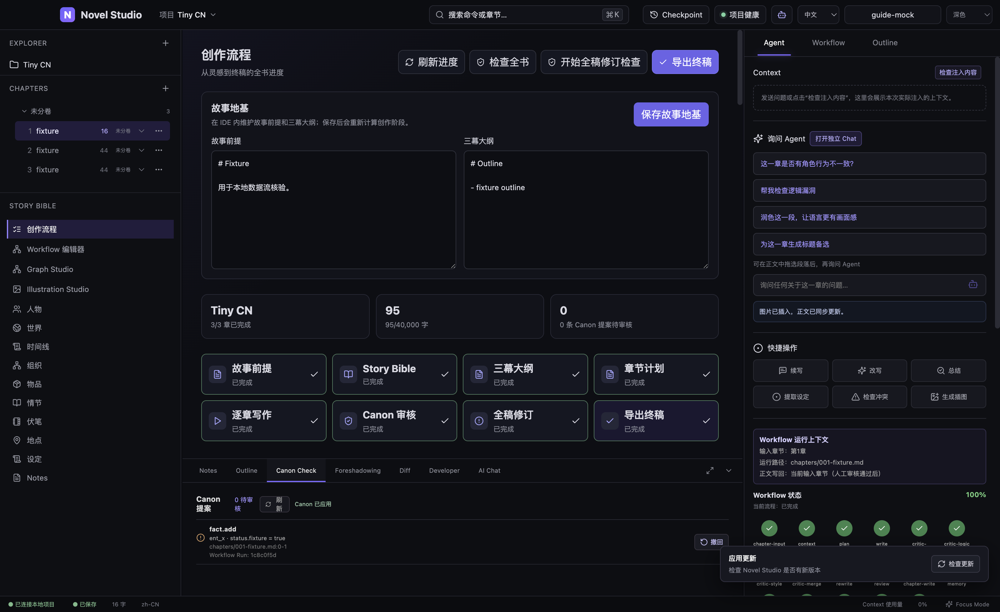

如果只想导出章节而不是走全稿门禁，也可以使用项目菜单或命令面板中的导出功能，选择：

- Markdown：适合继续编辑或交给排版工具；
- Plain text：只保留纯文本；
- HTML：适合预览和浏览器阅读。

导出图片时可选择清理图片元数据。若作品要公开发布，检查图片 provenance、文件路径和是否包含不应公开的生成信息。

## 3.5 备份、Checkpoint 和恢复

### 项目级备份

顶部项目菜单提供：

- 创建备份：完整项目归档；
- 创建增量：记录相对于前次备份的变化；
- 导出项目归档：选择目标 ZIP；
- 导入项目归档：从归档恢复到目标位置；
- 修复索引：从 Markdown、YAML 和资产 sidecar 重建 SQLite 索引；
- 关闭项目：返回欢迎页。

建议节点：创建项目后一次、每完成一幕一次、开始全稿修订前一次、导出终稿后一次。备份文件不要只放在项目目录内，至少再复制到另一块磁盘或云盘。

### Checkpoint

Checkpoint 更适合短期实验：在大幅重写、批量改名、调整 Workflow 前创建命名点。它和最终备份的差别是：Checkpoint 方便在项目内快速恢复，备份用于灾难恢复和跨设备保存。

### 项目健康与修复索引

出现“文件有但搜索不到”“Story Bible 计数不一致”时：

1. 先创建备份；
2. 打开“项目健康”；
3. 阅读缺失文件、无效源文件、过期 Embedding 和悬空引用；
4. 确认需要后点击“修复索引”；
5. 再次执行完整性检查。

修复索引主要重建索引，不应代替对正文源文件和 YAML 的人工检查。若源文件本身格式错误，先修源文件再修索引。

## 3.6 运行记录、失败和重试

Workflow 失败时先看失败节点，而不是马上重复运行。常见处理顺序：

1. 记录 Run ID 和失败节点；
2. 展开节点日志，确认是 Provider、Context、输入章节还是写回冲突；
3. 检查当前章节是否仍是原来的输入章节；
4. 修复 Prompt、Provider 或源文件；
5. 只重试失败节点或对应 Job；
6. 成功后回到编辑器，检查正文和 Canon 是否发生预期变化。

如果切换了章节，仍要确认 Retry 针对的是原 Run 的原始 `relPath`，不要误把失败的第 1 章重试到第 2 章。写回发生冲突时，优先保留当前人工编辑，比较 Diff 后再决定。

独立 Chat、Workflow 和 Developer 面板都会显示运行状态。Developer 诊断只应展示摘要、节点元数据和脱敏日志，不要通过截图或导出诊断分享 API Key、Provider secret 或完整私人章节。

## 3.7 常见问题排查表

| 现象 | 先检查 | 处理 |
| --- | --- | --- |
| 创建按钮不可用 | 项目名是否为空 | 填写项目名，再选择目录 |
| 初始化失败 | 目录是否已有正文、卷或多个章节 | 使用空目录；已有项目请走“打开已有项目” |
| 顶部显示未配置模型 | profile 是否保存、是否设为当前 | 打开 Provider 设置，保存、测试并选择“使用” |
| Chat 提示没有 Provider | 当前项目是否真的绑定 profile | 重新选择 profile，刷新项目后再发消息 |
| Context 太大或请求失败 | 注入来源、章节长度和 Context Window | 缩小请求范围、先做章节摘要或提高模型窗口；不要盲目重试 |
| AI 草稿没有写入正文 | 是否通过 Human Review | 在 Workflow 运行卡片中选择通过，再检查章节 |
| Canon 数量一直大于 0 | 是否还有 pending 提案 | 在 Canon Check 中 Apply 或拒绝每条提案并刷新 |
| 全稿修订被阻止 | 空章节、未审核章节、无 Story Bible、无时间线、未回收伏笔或完整性错误 | 按报告逐条修复，再重新准备全稿报告 |
| 导出按钮灰色 | 全书检查、全稿修订或 Canon 门禁未通过 | 先完成所有错误项，警告需由作者判断 |
| 搜索结果不更新 | 源文件和 SQLite 索引不同步 | 备份后运行项目健康检查和修复索引 |
| 图片能生成但不能插入 | 尚未通过 image.select 或图片资产不可用 | 在 Review & Insert 中选中资产，再插入 |
| 删除卷失败 | 卷内仍有章节 | 先把章节移动到其他卷，再删除卷 |

## 3.8 交付前最终清单

### 故事内容

- [ ] Premise 能用一段话说明主角、目标、阻力和时间压力。
- [ ] 三幕大纲和章节标题完整，14 章均有计划。
- [ ] 主要人物、地点、组织、物品和关键设定已进入 Story Bible。
- [ ] 重要事件有时间、地点、参与者、原因和结果。
- [ ] 每条伏笔都有 setup、target、状态和证据。

### AI 协作

- [ ] 每章都检查过实际 Context 来源。
- [ ] 规划、写作、人物审阅、逻辑审阅、文风审阅和重写职责清楚。
- [ ] 每章的 AI 草稿都经过 Human Review。
- [ ] 正文写回后重新打开检查，没有混入系统文本或 JSON。
- [ ] Canon 提案逐条人工 Apply、拒绝或保留为 pending。

### 工程与交付

- [ ] Provider 文本、Embedding 和图片连接按需测试通过。
- [ ] 项目健康检查通过，索引与源文件一致。
- [ ] 所有章节状态为 approved 或 revised。
- [ ] 全稿修订报告已准备并人工确认。
- [ ] 导出 Markdown/HTML/纯文本至少各抽查一份实际产物。
- [ ] 已创建最终备份，备份可在另一目录恢复。
- [ ] 公开分享前已检查图片 provenance、日志、诊断和密钥泄露。

完成这些步骤后，《雾港来信》就拥有一条可重复的本地写作流水线：正文仍是可读 Markdown，故事资料可检索，AI 输出可比较、可拒绝、可追溯，Canon 和终稿导出都经过明确的人工作家门禁。
